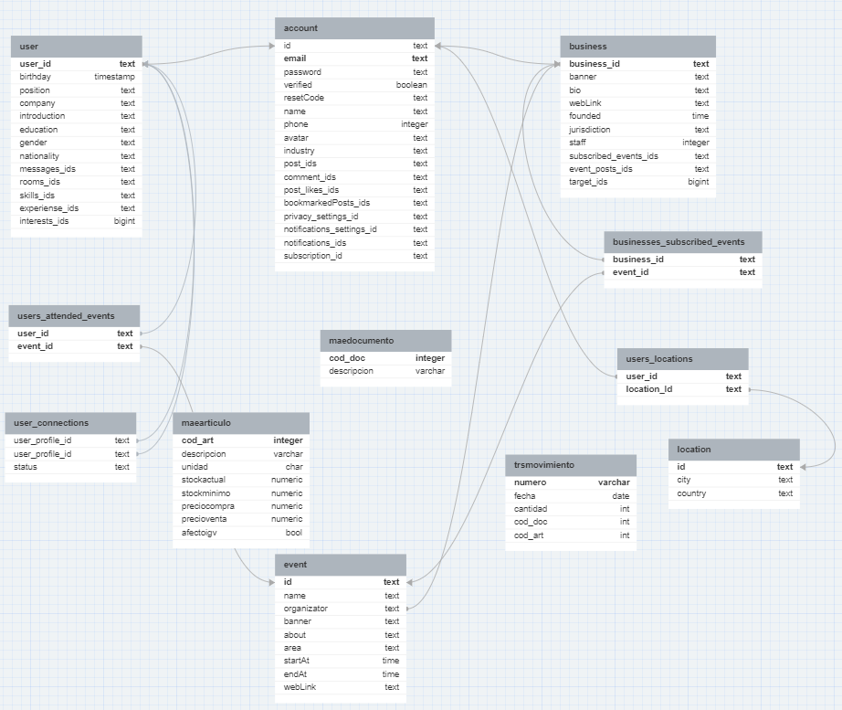
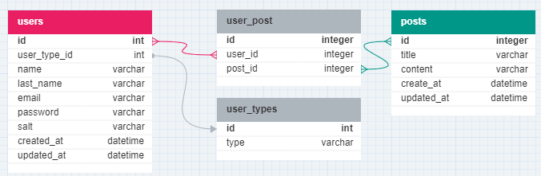
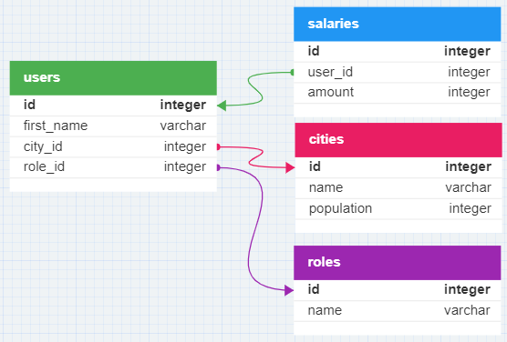
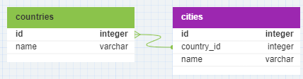
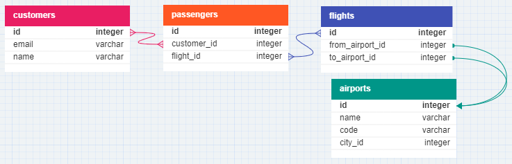

<!-- _class: lead -->

# <!--fit--> Fundamentals of SQL and ORM

Understanding SQL at its Core: Building a Strong Foundation for Data Management

<!-- The aim goal of this presentation is to show the main concepts of SQL and ORMs. -->

---

<!-- _class: invert -->

# Agenda

-  **SQL**
  - Definition, basic syntax, querying and more
-  **ORMs**
  - Definition, popular ORMs and examples
-  **Best Practices and Tips**
  - Performance, security and debugging

<!-- Here are the topics that will be covered. We'll start by looking at definitions of SQL and ORMs, including examples, followed by best practives and tips. -->

---


# SQL

**S**tructured **Q**uery **L**anguage

<!-- So what is SQL? It stands for structured query language. -->

---

<style scoped>
section li em {
  font-size: 25px;
}
</style>

#  SQL

- It is a standard language used for managing **relational databases**
- _A relational database is a type of database that stores and provides access to data points that are related to one another. (Oracle)_
- SQL provides a set of **commands** for interacting with **databases**
- _A database is an organized collection of structured information, or data, typically stored electronically in a computer system. (Oracle)_

 <!-- It is the standard used for ralational databases, which the data points are related to one another. It provides commands to create, retrieve, update and delete (CRUD) data from and to the database. -->

---

### SQL Database Management Systems

|                                                        DMS                                                         |         License         |
| :----------------------------------------------------------------------------------------------------------------: | :---------------------: |
|           MySQL          | Proprietary/Open-source |
|  Microsoft SQL Server |       Proprietary       |
|               Oracle              |       Proprietary       |
|           PostgreSQL          |       Open-source       |
|               SQLite              |       Open-source       |

 <!-- Here are a few examples of Relational Database Management Systems that use SQL -->

---

<!-- _class: invert -->

### SQL Database Example



 <!-- Take a look at this database architecture. It shows tables and relations between them. In the next slides we'll understand how everything is linked and model ourselves a few examples. -->

---

<!-- _class: invert -->

### Databases, Tables, Rows and Columns

Imagine we have a PostgreSQL server running:


_postgres://localhost:5432_

- #### Databases

- `blog`
- `supermarket`
- `gym`

 <!-- In this server, we can have multiple databases with different purposes and context, for instance, a database for a blog, a database for a supermarket and a database for a gym. Each of them can store data that is relevant for instance, users and blog posts for the first one, products and prices for the second and users and workout plans for the latest -->

---

<!-- _class: invert -->

### Databases, Tables, Rows and Columns

<div class="columns">
<div>

Databases act like _containers_ of related data.

In relational databases, the data is stored in **tables**

</div>
<div>

`blog` database:



4 tables, 3 _relations_

</div>
</div>

 <!-- In this example, the blog database has 4 tables, one for storing user data, one for storing posts data, one for storing user types (basic, admin or superuser, for instance) and one to map users and posts, which is called a junction table. These links are called relations and there are some types of relations possibles, which will be shown later. -->

---

<!-- _class: invert -->

### Databases, Tables, Rows and Columns

#### Table _Columns_

- `users`
  - `id` - int - **Primary** key
  - `user_type` - int - **Foreign** key
  - `name` - varchar
  - `...`
  - `created_at` - datetime

 <!-- Each table has columns, which are attributes of every entry (row) of the table. You can think of tables as spreadsheets. Each column has a type (int, char, datetime, enum, etc), and can have a constraint as well (unique, not null, etc). If the column is a **primary** key, it means that the column identifies the row of the table. If the column is a **foreign** key, that means it is related to ANOTHER table, and it uses the primary key OR another unique column of the other table. -->

---

<!-- _class: invert -->

### Databases, Tables, Rows and Columns

#### Table _Rows_

```bash {4}
blog=# select id, user_type_id, name, email, created_at from users;
 id | user_type_id |   name    |           email           |         created_at
----+--------------+-----------+---------------------------+----------------------------
  1 |            1 | André     | andre.luciani@email.com   | 2023-06-25 20:31:46.438607
  2 |            1 | John      | john.doe@email.com        | 2023-06-25 20:31:46.438607
  3 |            1 | Priscilla | priscilla.scott@email.com | 2023-06-25 20:31:46.438607
(3 rows)
```

 <!-- In this slide we can see some ROWS from the "users" table. Each row is one entry and has the attributes defined in the columns. -->

---

### SQL's Role in Database Management

- SQL is specifically designed for managing **relational** databases.

- It provides a standardized approach for _creating_, _modifying_, and _querying_ data.

- SQL ensures data _integrity_ and _consistency_ in relational databases.

 <!-- In summary, SQL is used to manage relational databases while ensuring data integrity and consistency. -->

---

  <!-- _class: invert -->

### Data Manipulation Language (DML)

- Subset of a programming language used explicitly to make changes in the database
  _(e.g. CRUD operations)_.

- In case of SQL:

  - `SELECT` - Retrieve

  - `INSERT` - Create

  - `UPDATE` - Modify existing data

  - `DELETE` - Exclude entries

 <!-- Data manipulation language is a subset of a programming language used to make changes in the database. Let's see some of them in the following slides. -->

---

  <!-- _class: invert -->
<style scoped>
li {
  font-size: 32px;
}
.language-sql {
  font-size: 150%;
}
</style>

### The `SELECT` statement

- Used to retrieve data. Basic syntax:

```sql
SELECT
  column1, column2, column3
FROM
  table_name;
```

- The wildcard `*` can be used to select "all columns"

- When making SQL statementes, always remember to close the statement with `;`

- The SQL words (`SELECT`, `FROM`, ...) usually are written with uppercase for better readability.

 <!-- The select statement is one of the most important. It is used to retrieve data and the basic syntax is as follows. -->

---

  <!-- _class: invert -->

### The `SELECT` statement

###### Example using [`psql`](https://www.postgresql.org/docs/current/app-psql.html):

```bash
psql      # starts postgres interactive terminal
\c blog   # connects to 'blog' database
```

###### After connecting to the database, execute the query:

```
blog=# SELECT id, name, last_name, email FROM users;
 id |   name    | last_name |           email
----+-----------+-----------+---------------------------
  1 | André     | Luciani   | andre.luciani@email.com
  2 | John      | Doe       | john.doe@email.com
  3 | Priscilla | Scott     | priscilla.scott@email.com
(3 rows)
```

 <!-- Here's one example using psql. -->

---

  <!-- _class: invert -->

<style scoped>
.language-sql {
  font-size: 150%;
}
</style>

### The `INSERT` statement

- Used to add data. Basic syntax:

```sql
INSERT INTO table_name(column1, column2, …)
VALUES (value1, value2, …);
```

- Multiple rows can be added by providing more values grouped with `()`

---

  <!-- _class: invert -->

<style scoped>
.language-sql {
  font-size: 150%;
}
</style>

### The `INSERT` statement

##### Adding a new row on the `posts` table:

```sql
INSERT INTO posts(title, content, create_at, updated_at)
VALUES ('Another post', 'Another example', NOW(), NOW());
```

- `NOW()` is a SQL [_function_](<https://www.postgresql.org/docs/devel/functions-datetime.html#:~:text=15%3A23.5%2B01-,now%20(%20),-%E2%86%92%20timestamp%20with>) that returns the current date and time. These functions may differ depending on the DMS used.

---

  <!-- _class: invert -->

### The `INSERT` statement

```diff
id |             title              |         content          |         create_at          |         updated_at
----+--------------------------------+--------------------------+----------------------------+----------------------------
  1 | PostgreSQL 101                 | This is an example post. | 2023-06-25 20:30:40.617806 | 2023-06-25 20:30:40.617806
  2 | Bread Recipe                   | This is an example post. | 2023-06-25 20:30:40.617806 | 2023-06-25 20:30:40.617806
  3 | Will AI take over the world?   | This is an example post. | 2023-06-25 20:30:40.617806 | 2023-06-25 20:30:40.617806
  4 | How to learn a new technology. | This is an example post. | 2023-06-25 20:30:40.617806 | 2023-06-25 20:30:40.617806
+ 5 | Another post                   | Another example          | 2023-06-25 22:23:57.567231 | 2023-06-25 22:23:57.567231
(5 rows)
```

---

  <!-- _class: invert -->

<style scoped>
.language-sql {
  font-size: 150%;
}
</style>

### The `UPDATE` statement

- Used to update entries.
  Basic syntax:

```sql
UPDATE table_name
SET column1 = value1,
    column2 = value2,
    ...
WHERE condition;
```

<!-- When updating a table, besides telling which table and columns we want to update, we must provide a condition to filter out only the rows that we want to update too. This can be specific enough to update only one single row, or more general, if we want to update multiple entries. -->

---

  <!-- _class: invert -->
<style scoped>
.language-sql {
  font-size: 150%;
}
</style>

### The `UPDATE` statement

###### Updating a row on the `posts` table:

```sql
UPDATE posts
SET content = 'The post content was updated!',
    updated_at = NOW(),
WHERE id = 2;
```

---

  <!-- _class: invert -->

### The `UPDATE` statement

```diff
 id |             title              |            content            |         create_at          |         updated_at
----+--------------------------------+-------------------------------+----------------------------+----------------------------
  1 | PostgreSQL 101                 | This is an example post.      | 2023-06-25 20:30:40.617806 | 2023-06-25 20:30:40.617806
- 2 | Bread Recipe                   | This is an example post.      | 2023-06-25 20:30:40.617806 | 2023-06-25 20:30:40.617806
  3 | Will AI take over the world?   | This is an example post.      | 2023-06-25 20:30:40.617806 | 2023-06-25 20:30:40.617806
  4 | How to learn a new technology. | This is an example post.      | 2023-06-25 20:30:40.617806 | 2023-06-25 20:30:40.617806
  5 | Another post                   | Another example               | 2023-06-25 22:23:57.567231 | 2023-06-25 22:23:57.567231
+ 2 | Bread Recipe                   | The post content was updated! | 2023-06-25 20:30:40.617806 | 2023-06-25 22:36:44.371102
```

---

  <!-- _class: invert -->
<style scoped>
.language-sql {
  font-size: 150%;
}
</style>

### The `DELETE` statement

Basic syntax:

```sql
DELETE FROM table_name
WHERE condition;
```

---

  <!-- _class: invert -->

<style scoped>
.language-sql {
  font-size: 150%;
}
</style>

### The `DELETE` statement

###### Deleting a row from the `posts` table:

```sql
DELETE FROM posts
WHERE id = 5;
```

---

  <!-- _class: invert -->

### The `DELETE` statement

```diff
 id |             title              |            content            |         create_at          |         updated_at
----+--------------------------------+-------------------------------+----------------------------+----------------------------
  1 | PostgreSQL 101                 | This is an example post.      | 2023-06-25 20:30:40.617806 | 2023-06-25 20:30:40.617806
  3 | Will AI take over the world?   | This is an example post.      | 2023-06-25 20:30:40.617806 | 2023-06-25 20:30:40.617806
  4 | How to learn a new technology. | This is an example post.      | 2023-06-25 20:30:40.617806 | 2023-06-25 20:30:40.617806
- 5 | Another post                   | Another example               | 2023-06-25 22:23:57.567231 | 2023-06-25 22:23:57.567231
  2 | Bread Recipe                   | The post content was updated! | 2023-06-25 20:30:40.617806 | 2023-06-25 22:36:44.371102
```

---

  <!-- _class: invert -->

### Data Definition Language (DDL)

- Subset of a programming language used to _define_ or _describe_ databases **schemas** (the "structure" of the DB).

- A few examples from SQL:

  - `CREATE TABLE` - Create tables

  - `ALTER TABLE` - Modify existing tables

  - `DROP TABLE` - Exclude tables

 <!-- If DML is used to CRUD entries, the DDL is used to CRUD structures. For instance, if you want to add a new column to an existing table, you will use DML. -->

---

  <!-- _class: invert -->
<style scoped>
li {
  font-size: 32px;
}
.language-sql {
  font-size: 120%;
}
</style>

### The `CREATE TABLE` statement

- Used to create tables. Basic syntax:

```sql
CREATE TABLE table_name (
   column1 datatype(length) column_constraint,
   column2 datatype(length) column_constraint,
   column3 datatype(length) column_constraint,
   table_constraints
);
```

- Each column has a [**datatype**](https://www.postgresql.org/docs/current/datatype.html) and may have [**constraints**](https://www.postgresql.org/docs/15/ddl-constraints.html).

- The statement `CREATE TABLE IF NOT EXISTS ...` can be used to prevent an error if the table name is already in use.

 <!-- When creating a table, we must provide the name of the table, the name of each column along with its datatype and possible constraints as well as table constraints. -->

---

  <!-- _class: invert -->
<style scoped>
li {
  font-size: 30px;
  padding-left: 1px;
}
</style>

### The `CREATE TABLE` statement

#### Constraints

- Used to ensure data **consistency**

- Common constraints used in columns:

  - `NOT NULL` - values cannot be `null`

  - `UNIQUE` - all rows must have different values for the column

  - `PRIMARY KEY` - Column that is unique, not null and used to identify each row of a table.

  - `CHECK` - Boolean verifier to prevent wrong inputs
    (e.g. `CHECK (price > 0)`)

 <!-- The costraints are a powerful way to prevent wrong inputs. They are a set of rules that must be met when modifying data in a database. -->

---

  <!-- _class: invert -->
<style scoped>
li {
  font-size: 32px;
}
.language-sql {
  font-size: 120%;
}
</style>

### The `CREATE TABLE` statement

```sql
CREATE TABLE posts (
    id serial PRIMARY KEY,
    title varchar NOT NULL,
    content varchar NOT NULL,
    create_at TIMESTAMP NOT NULL,
    updated_at TIMESTAMP NOT NULL
);
```

- The title and content could have a minimum lenght and the `create_at` and `updated_at` columns could have default values.

- The `create_at` column has a typo, thankfully not everything is doomed yet...

 <!-- Here's one example using psql. -->

---

  
  <!-- _class: invert -->
<style scoped>
li {
  font-size: 32px;
}
.language-sql {
  font-size: 120%;
}
</style>

### The `ALTER TABLE` statement

- Used to modify tables. Usually **add**, **remove**, **rename** columns or its constraints:

```sql
ALTER TABLE table_name 
RENAME COLUMN column_name 
TO new_column_name;
```

```sql
ALTER TABLE table_name 
ADD COLUMN column_name datatype column_constraint;
```

```sql
ALTER TABLE table_name 
DROP COLUMN column_name;
```

 <!-- Here are a few examples of the ALTER TABLE syntax. -->

---

  <!-- _class: invert -->

<style scoped>
.language-sql {
  font-size: 150%;
}
</style>

### The `ALTER TABLE` statement

##### Fixing the typo on the `create_at` column:

```sql
ALTER TABLE posts
RENAME create_at
TO created_at;
```

---

  <!-- _class: invert -->

<style scoped>
.language-sql {
  font-size: 150%;
}
</style>

### The `ALTER TABLE` statement

- It is possible to add only constraints as well, for instance:

```sql
ALTER TABLE users
ADD CONSTRAINT users_fk0 FOREIGN KEY (user_type_id) REFERENCES user_types(id);
ALTER TABLE user_post
ADD CONSTRAINT user_post_fk0 FOREIGN KEY (user_id) REFERENCES users(id);
ALTER TABLE user_post
ADD CONSTRAINT user_post_fk1 FOREIGN KEY (post_id) REFERENCES posts(id);
```

---

  <!-- _class: invert -->

### The `DROP TABLE` statement

- As the database evolves, it might be necessary to exclude tables (e.g. a table was deprecated because the data it held is now being stored in another place)

- The `DROP TABLE` command is used for these cases.

---

  <!-- _class: invert -->

<style scoped>
.language-sql {
  font-size: 150%;
}
</style>

### The `DROP TABLE` statement

Basic syntax:

```sql
DROP TABLE table_name;
```

---

  <!-- _class: invert -->
<style scoped>
.language-sql {
  font-size: 120%;
}
</style>

### The `DROP TABLE` statement

###### Deleting the `posts` table:

```sql
DROP TABLE posts;
```

###### But...
```
blog=# DROP TABLE posts;
ERROR:  cannot drop table posts because other objects depend on it
DETAIL:  constraint user_post_fk1 on table user_post depends on table posts
HINT:  Use DROP ... CASCADE to drop the dependent objects too.
```
- Since it has constraints, the operation cannot be done...

---

  <!-- _class: invert -->
  <!-- transition: cover -->

<style scoped>
.language-sql {
  font-size: 120%;
}
</style>

### The `DROP TABLE` statement

- Using the [`CASCADE`](https://www.postgresql.org/docs/15/sql-droptable.html#:~:text=table%20to%20drop.-,CASCADE,-Automatically%20drop%20objects) solves the problem

```sql
DROP TABLE posts CASCADE;
```

```
blog=# DROP TABLE posts CASCADE;
NOTICE:  drop cascades to constraint user_post_fk1 on table user_post
DROP TABLE
```
- The operation returns which constraints were dropped because of `CASCADE`.

---

# A few considerations

---

* While modifying one column from one table is straightforward, even that can have a great impact in a large database.

* When making such modifications, we have to address how to deal with the "old" data. In some cases the solution involves setting a default value or maybe running a script to make the old data consistent with the changes introduced.

---

<!-- transition: fade -->

* The versioning of databases introduces the concept of **migrations**

* It uses scripts (that can be written in several programming languages) to make the modifications more consistent and easy to roll-back. More on that on the _ORM_ part.

* In any case, it is always recomended to make database backups before making schema changes.

---

<!-- _class: invert -->

# Database Relationships

There are three main SQL database relationships:

1. One-to-one
2. One-to-many (or Many-to-one)
3. Many-to-many

**Let's see when to use each of them!**

---

<!-- _class: invert -->

# _One-to-One_

This relation is used when **one** row of `table_one` is linked (or related) to only **one** row of `table_two`

Example: A person and their birthplace, an employee and their salary, a user and their role

---

<!-- _class: invert -->

# _One-to-One_



---

<!-- _class: invert -->

# _One-to-One_

To achieve a one-to-one relationship between tables:

1. Create the two tables that will be linked
2. On one table, add a column with the `FOREIGN KEY` constraint.
3. The `FOREIGN KEY` column **must be** `UNIQUE`

---

<!-- _class: invert -->

# _One-to-One_

```sql
CREATE TABLE users (
  id serial PRIMARY KEY,
  first_name VARCHAR(50)
);

CREATE TABLE salaries (
  user_id int UNIQUE NOT NULL,
  amount int
);

ALTER TABLE salaries
ADD CONSTRAINT users_salaries_fk0
FOREIGN KEY (user_id)
REFERENCES users (id);
```

---

<!-- _class: invert -->

# _One-to-Many_

The _one-to-many_ relation is the most used relation in SQL and occurs when **one** row from `table_one` is related one or **many** rows in `table_two`.

Example: A country and its states or cities, students and the class they belong to, employees and their department, among several others.

---

<!-- _class: invert -->

# _One-to-Many_



---

<!-- _class: invert -->

# _One-to-Many_

To achieve a one-to-many relationship between tables:

1. Create the two tables that will be linked
2. On one table, add a column with the `FOREIGN KEY` constraint.

---

<!-- _class: invert -->
<!-- _transition: cover -->

# _One-to-Many_

```sql
CREATE TABLE countries (
    id serial PRIMARY KEY,
    name varchar NOT NULL,
);
CREATE TABLE cities (
    id serial PRIMARY KEY,
    country_id integer NOT NULL,
    name varchar NOT NULL,
);
ALTER TABLE cities
ADD CONSTRAINT cities_fk0
FOREIGN KEY (country_id)
REFERENCES countries(id);
```

---

## _One-to-Many_ or _Many-to-One_ ?

* While many people do not differentiate the two relations, it is just a matter of focus.

* If we take the example shown: countries and cities. A country is consisted of many cities, in this case, coutry to city is a _one-to-many_ relationship.

* On the other hand, if we focus on the cities, we can say that many cities are part of one country, resulting in a _many-to-one_ relationship.
---

<!-- _class: invert -->

# _Many-to-Many_

The _many-to-many_ relation occurs when **many** rows from `table_one` are related to **many** rows in `table_two`.

Example: Product and suppliers, flights and passengers, etc.

---

<!-- _class: invert -->
<style scoped>
li {
  font-size: 22pt;
}
</style>

# _Many-to-Many_



* _Many-to-many_ relation between `customers` and `flights` throught the `passengers` table
* The `flights` table has two _one-to-one_ relationships with `airports` table.

---

<!-- _class: invert -->
# _Many-to-Many_

To achieve a many-to-many relationship between tables:

1. Create the two tables that will be linked
2. Create a third table (called _linking_, _bridging_ or _junction_ table)
3. The third table will store the primary keys of both the tables to be linked

---

<!-- _class: invert -->
<style scoped>
.language-sql {
  font-size: 90%;
}
</style>
# _Many-to-Many_

Creating the tables:

```sql
CREATE TABLE customers (
    id serial PRIMARY KEY,
    email varchar NOT NULL UNIQUE,
    name varchar NOT NULL,
);
CREATE TABLE passengers (
    id serial PRIMARY KEY,
    customer_id integer NOT NULL,
    flight_id integer NOT NULL,
);
CREATE TABLE flights (
    id serial PRIMARY KEY,
    from_airport_id integer NOT NULL,
    to_airport_id integer NOT NULL,
);
```

---

<!-- _class: invert -->

# _Many-to-Many_

Adding the constraints:

```sql
ALTER TABLE flights
ADD CONSTRAINT flights_fk0
FOREIGN KEY (from_airport_id)
REFERENCES airports(id);

ALTER TABLE flights
ADD CONSTRAINT flights_fk1
FOREIGN KEY (to_airport_id)
REFERENCES airports(id);
```

---

<!-- _class: invert -->

# Agenda

-  **~~SQL~~**

-  **ORMs**
  - Definition, popular ORMs and examples
-  **Best Practices and Tips**
  - Performance, security and debugging

<!-- With the SQL part complete, let's dive in ORMs -->

---


# ORM

**O**bject **R**elational **M**apping

<!-- So what is ORM? It stands for object relational mapping. -->

---

<style scoped>
section li em {
  font-size: 25px;
}
</style>

#  ORM

- ...

 <!-- Presenter notes. -->

---

<!-- _class: invert -->

# Agenda

-  **~~SQL~~**

-  **~~ORMs~~**
-  **Best Practices and Tips**
  - Performance, security and debugging

<!-- With the SQL part complete, let's dive in ORMs -->

---


# Best Practices and Tips

Things to pay attention!

<!-- So what is ORM? It stands for object relational mapping. -->

---

<style scoped>
section li em {
  font-size: 25px;
}
</style>

##  Best Practices and Tips

- ...

 <!-- Presenter notes. -->
