<!-- _class: lead -->

# <!--fit--> Fundamentals of SQL and ORM

Understanding SQL at its Core: Building a Strong Foundation for Data Management

<!-- The aim goal of this presentation is to show the main concepts of SQL and ORMs. -->

---

<!-- _class: invert -->

# Agenda

-  **SQL**
  - Definition, basic syntax, querying and more
-  **ORMs**
  - Definition, popular ORMs and examples
-  **Best Practices and Tips**
  - Performance, security and debugging

<!-- Here are the topics that will be covered. We'll start by looking at definitions of SQL and ORMs, including examples, followed by best practives and tips. -->

---


# SQL

**S**tructured **Q**uery **L**anguage

<!-- So what is SQL? It stands for structured query language. -->

---

<style scoped>
section li em {
  font-size: 25px;
}
</style>

#  SQL

- It is a standard language used for managing **relational databases**
- _A relational database is a type of database that stores and provides access to data points that are related to one another. (Oracle)_
- SQL provides a set of **commands** for interacting with **databases**
- _A database is an organized collection of structured information, or data, typically stored electronically in a computer system. (Oracle)_

 <!-- It is the standard used for ralational databases, which the data points are related to one another. It provides commands to create, retrieve, update and delete (CRUD) data from and to the database. -->

---

### SQL Database Management Systems

|                                                        DMS                                                         |         License         |
| :----------------------------------------------------------------------------------------------------------------: | :---------------------: |
|           MySQL          | Proprietary/Open-source |
|  Microsoft SQL Server |       Proprietary       |
|               Oracle              |       Proprietary       |
|           PostgreSQL          |       Open-source       |
|               SQLite              |       Open-source       |

 <!-- Here are a few examples of Relational Database Management Systems that use SQL -->

---

<!-- _class: invert -->

### SQL Database Example


 <!-- Take a look at this database architecture. It shows tables and relations between them. In the next slides we'll understand how everything is linked and model ourselves a few examples. -->

---

<!-- _class: invert -->

### Databases, Tables, Rows and Columns

Imagine we have a PostgreSQL server running:


_postgres://localhost:5432_

- #### Databases

- `blog`
- `supermarket`
- `gym`

 <!-- In this server, we can have multiple databases with different purposes and context, for instance, a database for a blog, a database for a supermarket and a database for a gym. Each of them can store data that is relevant for instance, users and blog posts for the first one, products and prices for the second and users and workout plans for the latest -->

---

<!-- _class: invert -->

### Databases, Tables, Rows and Columns

<div class="columns">
<div>

Databases act like _containers_ of related data.

In relational databases, the data is stored in **tables**

</div>
<div>

`blog` database:

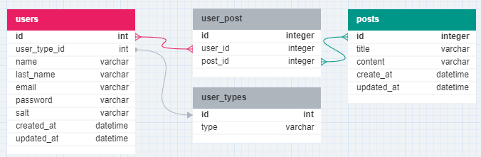

4 tables, 3 _relations_

</div>
</div>

 <!-- In this example, the blog database has 4 tables, one for storing user data, one for storing posts data, one for storing user types (basic, admin or superuser, for instance) and one to map users and posts, which is called a junction table. These links are called relations and there are some types of relations possibles, which will be shown later. -->

---

<!-- _class: invert -->

### Databases, Tables, Rows and Columns

#### Table _Columns_

- `users`
  - `id` - int - **Primary** key
  - `user_type` - int - **Foreign** key
  - `name` - varchar
  - `...`
  - `created_at` - datetime

 <!-- Each table has columns, which are attributes of every entry (row) of the table. You can think of tables as spreadsheets. Each column has a type (int, char, datetime, enum, etc), and can have a constraint as well (unique, not null, etc). If the column is a **primary** key, it means that the column identifies the row of the table. If the column is a **foreign** key, that means it is related to ANOTHER table, and it uses the primary key OR another unique column of the other table. -->

---

<!-- _class: invert -->

### Databases, Tables, Rows and Columns

#### Table _Rows_

```bash {4}
blog=# select id, user_type_id, name, email, created_at from users;
 id | user_type_id |   name    |           email           |         created_at
----+--------------+-----------+---------------------------+----------------------------
  1 |            1 | André     | andre.luciani@email.com   | 2023-06-25 20:31:46.438607
  2 |            1 | John      | john.doe@email.com        | 2023-06-25 20:31:46.438607
  3 |            1 | Priscilla | priscilla.scott@email.com | 2023-06-25 20:31:46.438607
(3 rows)
```

 <!-- In this slide we can see some ROWS from the "users" table. Each row is one entry and has the attributes defined in the columns. -->

---

### SQL's Role in Database Management

- SQL is specifically designed for managing **relational** databases.

- It provides a standardized approach for _creating_, _modifying_, and _querying_ data.

- SQL ensures data _integrity_ and _consistency_ in relational databases.

 <!-- In summary, SQL is used to manage relational databases while ensuring data integrity and consistency. -->

---

  <!-- _class: invert -->

### Data Manipulation Language (DML)

- Subset of a programming language used explicitly to make changes in the database
  _(e.g. CRUD operations)_.

- In case of SQL:

  - `SELECT` - Retrieve

  - `INSERT` - Create

  - `UPDATE` - Modify existing data

  - `DELETE` - Exclude entries

 <!-- Data manipulation language is a subset of a programming language used to make changes in the database. Let's see some of them in the following slides. -->

---

  <!-- _class: invert -->
<style scoped>
li {
  font-size: 32px;
}
.language-sql {
  font-size: 150%;
}
</style>

### The `SELECT` statement

- Used to retrieve data. Basic syntax:

```sql
SELECT
  column1, column2, column3
FROM
  table_name;
```

- The wildcard `*` can be used to select "all columns"

- When making SQL statementes, always remember to close the statement with `;`

- The SQL words (`SELECT`, `FROM`, ...) usually are written with uppercase for better readability.

 <!-- The select statement is one of the most important. It is used to retrieve data and the basic syntax is as follows. -->

---

  <!-- _class: invert -->

### The `SELECT` statement

###### Example using [`psql`](https://www.postgresql.org/docs/current/app-psql.html):

```bash
psql      # starts postgres interactive terminal
\c blog   # connects to 'blog' database
```

###### After connecting to the database, execute the query:

```
blog=# SELECT id, name, last_name, email FROM users;
 id |   name    | last_name |           email
----+-----------+-----------+---------------------------
  1 | André     | Luciani   | andre.luciani@email.com
  2 | John      | Doe       | john.doe@email.com
  3 | Priscilla | Scott     | priscilla.scott@email.com
(3 rows)
```

 <!-- Here's one example using psql. -->

---

  <!-- _class: invert -->

<style scoped>
.language-sql {
  font-size: 150%;
}
</style>

### The `INSERT` statement

- Used to add data. Basic syntax:

```sql
INSERT INTO table_name(column1, column2, …)
VALUES (value1, value2, …);
```

- Multiple rows can be added by providing more values grouped with `()`

---

  <!-- _class: invert -->

<style scoped>
.language-sql {
  font-size: 150%;
}
</style>

### The `INSERT` statement

##### Adding a new row on the `posts` table:

```sql
INSERT INTO posts(title, content, create_at, updated_at)
VALUES ('Another post', 'Another example', NOW(), NOW());
```

- `NOW()` is a SQL [_function_](<https://www.postgresql.org/docs/devel/functions-datetime.html#:~:text=15%3A23.5%2B01-,now%20(%20),-%E2%86%92%20timestamp%20with>) that returns the current date and time. These functions may differ depending on the DMS used.

---

  <!-- _class: invert -->

### The `INSERT` statement

```diff
id |             title              |         content          |         create_at          |         updated_at
----+--------------------------------+--------------------------+----------------------------+----------------------------
  1 | PostgreSQL 101                 | This is an example post. | 2023-06-25 20:30:40.617806 | 2023-06-25 20:30:40.617806
  2 | Bread Recipe                   | This is an example post. | 2023-06-25 20:30:40.617806 | 2023-06-25 20:30:40.617806
  3 | Will AI take over the world?   | This is an example post. | 2023-06-25 20:30:40.617806 | 2023-06-25 20:30:40.617806
  4 | How to learn a new technology. | This is an example post. | 2023-06-25 20:30:40.617806 | 2023-06-25 20:30:40.617806
+ 5 | Another post                   | Another example          | 2023-06-25 22:23:57.567231 | 2023-06-25 22:23:57.567231
(5 rows)
```

---

  <!-- _class: invert -->

<style scoped>
.language-sql {
  font-size: 150%;
}
</style>

### The `UPDATE` statement

- Used to update entries.
  Basic syntax:

```sql
UPDATE table_name
SET column1 = value1,
    column2 = value2,
    ...
WHERE condition;
```

<!-- When updating a table, besides telling which table and columns we want to update, we must provide a condition to filter out only the rows that we want to update too. This can be specific enough to update only one single row, or more general, if we want to update multiple entries. -->

---

  <!-- _class: invert -->
<style scoped>
.language-sql {
  font-size: 150%;
}
</style>

### The `UPDATE` statement

###### Updating a row on the `posts` table:

```sql
UPDATE posts
SET content = 'The post content was updated!',
    updated_at = NOW(),
WHERE id = 2;
```

---

  <!-- _class: invert -->

### The `UPDATE` statement

```diff
 id |             title              |            content            |         create_at          |         updated_at
----+--------------------------------+-------------------------------+----------------------------+----------------------------
  1 | PostgreSQL 101                 | This is an example post.      | 2023-06-25 20:30:40.617806 | 2023-06-25 20:30:40.617806
- 2 | Bread Recipe                   | This is an example post.      | 2023-06-25 20:30:40.617806 | 2023-06-25 20:30:40.617806
  3 | Will AI take over the world?   | This is an example post.      | 2023-06-25 20:30:40.617806 | 2023-06-25 20:30:40.617806
  4 | How to learn a new technology. | This is an example post.      | 2023-06-25 20:30:40.617806 | 2023-06-25 20:30:40.617806
  5 | Another post                   | Another example               | 2023-06-25 22:23:57.567231 | 2023-06-25 22:23:57.567231
+ 2 | Bread Recipe                   | The post content was updated! | 2023-06-25 20:30:40.617806 | 2023-06-25 22:36:44.371102
```

---

  <!-- _class: invert -->
<style scoped>
.language-sql {
  font-size: 150%;
}
</style>

### The `DELETE` statement

Basic syntax:

```sql
DELETE FROM table_name
WHERE condition;
```

---

  <!-- _class: invert -->

<style scoped>
.language-sql {
  font-size: 150%;
}
</style>

### The `DELETE` statement

###### Deleting a row from the `posts` table:

```sql
DELETE FROM posts
WHERE id = 5;
```

---

  <!-- _class: invert -->

### The `DELETE` statement

```diff
 id |             title              |            content            |         create_at          |         updated_at
----+--------------------------------+-------------------------------+----------------------------+----------------------------
  1 | PostgreSQL 101                 | This is an example post.      | 2023-06-25 20:30:40.617806 | 2023-06-25 20:30:40.617806
  3 | Will AI take over the world?   | This is an example post.      | 2023-06-25 20:30:40.617806 | 2023-06-25 20:30:40.617806
  4 | How to learn a new technology. | This is an example post.      | 2023-06-25 20:30:40.617806 | 2023-06-25 20:30:40.617806
- 5 | Another post                   | Another example               | 2023-06-25 22:23:57.567231 | 2023-06-25 22:23:57.567231
  2 | Bread Recipe                   | The post content was updated! | 2023-06-25 20:30:40.617806 | 2023-06-25 22:36:44.371102
```

---

  <!-- _class: invert -->

### Data Definition Language (DDL)

- Subset of a programming language used to _define_ or _describe_ databases **schemas** (the "structure" of the DB).

- A few examples from SQL:

  - `CREATE TABLE` - Create tables

  - `ALTER TABLE` - Modify existing tables

  - `DROP TABLE` - Exclude tables

 <!-- If DML is used to CRUD entries, the DDL is used to CRUD structures. For instance, if you want to add a new column to an existing table, you will use DML. -->

---

  <!-- _class: invert -->
<style scoped>
li {
  font-size: 32px;
}
.language-sql {
  font-size: 120%;
}
</style>

### The `CREATE TABLE` statement

- Used to create tables. Basic syntax:

```sql
CREATE TABLE table_name (
   column1 datatype(length) column_constraint,
   column2 datatype(length) column_constraint,
   column3 datatype(length) column_constraint,
   table_constraints
);
```

- Each column has a [**datatype**](https://www.postgresql.org/docs/current/datatype.html) and may have [**constraints**](https://www.postgresql.org/docs/15/ddl-constraints.html).

- The statement `CREATE TABLE IF NOT EXISTS ...` can be used to prevent an error if the table name is already in use.

 <!-- When creating a table, we must provide the name of the table, the name of each column along with its datatype and possible constraints as well as table constraints. -->

---

  <!-- _class: invert -->
<style scoped>
li {
  font-size: 30px;
  padding-left: 1px;
}
</style>

### The `CREATE TABLE` statement

#### Constraints

- Used to ensure data **consistency**

- Common constraints used in columns:

  - `NOT NULL` - values cannot be `null`

  - `UNIQUE` - all rows must have different values for the column

  - `PRIMARY KEY` - Column that is unique, not null and used to identify each row of a table.

  - `CHECK` - Boolean verifier to prevent wrong inputs
    (e.g. `CHECK (price > 0)`)

 <!-- The costraints are a powerful way to prevent wrong inputs. They are a set of rules that must be met when modifying data in a database. -->

---

  <!-- _class: invert -->
<style scoped>
li {
  font-size: 30px;
  padding-left: 1px;
}
</style>

### The `CREATE TABLE` statement

#### Constraints

- Common constraints used in columns (a few more):

  - `FOREIGN KEY` - Link tables by storing the `PRIMARY KEY`of another table.

  - `DEFAULT` - Sets a default value for a column if no value is specified

  - `CREATE INDEX` - Used to create and retrieve data from the database very quickly (more on that later)

 <!-- The costraints are a powerful way to prevent wrong inputs. They are a set of rules that must be met when modifying data in a database. -->

---

  <!-- _class: invert -->
<style scoped>
li {
  font-size: 32px;
}
.language-sql {
  font-size: 120%;
}
</style>

### The `CREATE TABLE` statement

```sql
CREATE TABLE posts (
    id serial PRIMARY KEY,
    title varchar NOT NULL,
    content varchar NOT NULL,
    create_at TIMESTAMP NOT NULL,
    updated_at TIMESTAMP NOT NULL
);
```

- The title and content could have a minimum lenght and the `create_at` and `updated_at` columns could have default values.

- The `create_at` column has a typo, thankfully not everything is doomed yet...

 <!-- Here's one example using psql. -->

---

  <!-- _class: invert -->
<style scoped>
li {
  font-size: 32px;
}
.language-sql {
  font-size: 120%;
}
</style>

### The `ALTER TABLE` statement

- Used to modify tables. Usually **add**, **remove**, **rename** columns or its constraints:

```sql
ALTER TABLE table_name
RENAME COLUMN column_name
TO new_column_name;
```

```sql
ALTER TABLE table_name
ADD COLUMN column_name datatype column_constraint;
```

```sql
ALTER TABLE table_name
DROP COLUMN column_name;
```

 <!-- Here are a few examples of the ALTER TABLE syntax. -->

---

  <!-- _class: invert -->

<style scoped>
.language-sql {
  font-size: 150%;
}
</style>

### The `ALTER TABLE` statement

##### Fixing the typo on the `create_at` column:

```sql
ALTER TABLE posts
RENAME create_at
TO created_at;
```

---

  <!-- _class: invert -->

<style scoped>
.language-sql {
  font-size: 150%;
}
</style>

### The `ALTER TABLE` statement

- It is possible to add only constraints as well, for instance:

```sql
ALTER TABLE users
ADD CONSTRAINT users_fk0 FOREIGN KEY (user_type_id) REFERENCES user_types(id);
ALTER TABLE user_post
ADD CONSTRAINT user_post_fk0 FOREIGN KEY (user_id) REFERENCES users(id);
ALTER TABLE user_post
ADD CONSTRAINT user_post_fk1 FOREIGN KEY (post_id) REFERENCES posts(id);
```

---

  <!-- _class: invert -->

### The `DROP TABLE` statement

- As the database evolves, it might be necessary to exclude tables (e.g. a table was deprecated because the data it held is now being stored in another place)

- The `DROP TABLE` command is used for these cases.

---

  <!-- _class: invert -->

<style scoped>
.language-sql {
  font-size: 150%;
}
</style>

### The `DROP TABLE` statement

Basic syntax:

```sql
DROP TABLE table_name;
```

---

  <!-- _class: invert -->
<style scoped>
.language-sql {
  font-size: 120%;
}
</style>

### The `DROP TABLE` statement

###### Deleting the `posts` table:

```sql
DROP TABLE posts;
```

###### But...

```
blog=# DROP TABLE posts;
ERROR:  cannot drop table posts because other objects depend on it
DETAIL:  constraint user_post_fk1 on table user_post depends on table posts
HINT:  Use DROP ... CASCADE to drop the dependent objects too.
```

- Since it has constraints, the operation cannot be done...

---

  <!-- _class: invert -->
  <!-- transition: cover -->

<style scoped>
.language-sql {
  font-size: 120%;
}
</style>

### The `DROP TABLE` statement

- Using the [`CASCADE`](https://www.postgresql.org/docs/15/sql-droptable.html#:~:text=table%20to%20drop.-,CASCADE,-Automatically%20drop%20objects) solves the problem

```sql
DROP TABLE posts CASCADE;
```

```
blog=# DROP TABLE posts CASCADE;
NOTICE:  drop cascades to constraint user_post_fk1 on table user_post
DROP TABLE
```

- The operation returns which dependent objects were dropped because of `CASCADE`.

---

# A few considerations

---

- While modifying one column from one table is straightforward, even that can have a great impact in a large database.

- When making such modifications, we have to address how to deal with the "old" data. In some cases the solution involves setting a default value or maybe running a script to make the old data consistent with the changes introduced.

---

<!-- transition: fade -->

- The versioning of databases introduces the concept of **migrations**

- It uses scripts (that can be written in several programming languages) to make the modifications more consistent and easy to roll-back. More on that on the _ORM_ part.

- In any case, it is always recomended to make database backups before making schema changes.

---

<!-- _class: invert -->
<!-- _transition: cover -->

# Database Relationships

There are three main SQL database relationships:

1. One-to-one
2. One-to-many (or Many-to-one)
3. Many-to-many

**Let's see when to use each of them!**

---

# _One-to-One_

---

<!-- _class: invert -->

# _One-to-One_

This relation is used when **one** row of `table_one` is linked (or related) to only **one** row of `table_two`

Example: A person and their birthplace, an employee and their salary, a user and their role

---

<!-- _class: invert -->

# _One-to-One_


---

<!-- _class: invert -->

# _One-to-One_

To achieve a one-to-one relationship between tables:

1. Create the two tables that will be linked
2. On one table, add a column with the `FOREIGN KEY` constraint.
3. The `FOREIGN KEY` column **must be** `UNIQUE`

---

<!-- _class: invert -->
<!-- _transition: cover -->

# _One-to-One_

```sql
CREATE TABLE users (
  id serial PRIMARY KEY,
  first_name VARCHAR(50)
);

CREATE TABLE salaries (
  user_id int UNIQUE NOT NULL,
  amount int
);

ALTER TABLE salaries
ADD CONSTRAINT users_salaries_fk0
FOREIGN KEY (user_id)
REFERENCES users (id);
```

---

# _One-to-Many_

---

<!-- _class: invert -->

# _One-to-Many_

The _one-to-many_ relation is the most used relation in SQL and occurs when **one** row from `table_one` is related one or **many** rows in `table_two`.

Example: A country and its states or cities, students and the class they belong to, employees and their department, among several others.

---

<!-- _class: invert -->

# _One-to-Many_

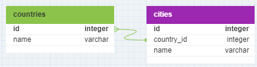

---

<!-- _class: invert -->

# _One-to-Many_

To achieve a one-to-many relationship between tables:

1. Create the two tables that will be linked
2. On one table, add a column with the `FOREIGN KEY` constraint.

---

<!-- _class: invert -->
<!-- _transition: cover -->

# _One-to-Many_

```sql
CREATE TABLE countries (
    id serial PRIMARY KEY,
    name varchar NOT NULL,
);
CREATE TABLE cities (
    id serial PRIMARY KEY,
    country_id integer NOT NULL,
    name varchar NOT NULL,
);
ALTER TABLE cities
ADD CONSTRAINT cities_fk0
FOREIGN KEY (country_id)
REFERENCES countries(id);
```

---

## _One-to-Many_ or _Many-to-One_ ?

- While many people do not differentiate the two relations, it is just a matter of focus.

- If we take the example shown: countries and cities. A country is consisted of many cities, in this case, coutry to city is a _one-to-many_ relationship.

- On the other hand, if we focus on the cities, we can say that many cities are part of one country, resulting in a _many-to-one_ relationship.

---

# _Many-to-Many_

---

<!-- _class: invert -->

# _Many-to-Many_

The _many-to-many_ relation occurs when **many** rows from `table_one` are related to **many** rows in `table_two`.

Example: Product and suppliers, flights and passengers, etc.

---

<!-- _class: invert -->
<style scoped>
li {
  font-size: 22pt;
}
</style>

# _Many-to-Many_


- _Many-to-many_ relation between `customers` and `flights` throught the `passengers` table
- The `flights` table has two _one-to-one_ relationships with `airports` table.

---

<!-- _class: invert -->

# _Many-to-Many_

To achieve a many-to-many relationship between tables:

1. Create the two tables that will be linked
2. Create a third table (called _linking_, _bridging_ or _junction_ table)
3. The third table will store the primary keys of both the tables to be linked

---

<!-- _class: invert -->
<style scoped>
.language-sql {
  font-size: 90%;
}
</style>

# _Many-to-Many_

Creating the tables:

```sql
CREATE TABLE customers (
    id serial PRIMARY KEY,
    email varchar NOT NULL UNIQUE,
    name varchar NOT NULL,
);
CREATE TABLE passengers (
    id serial PRIMARY KEY,
    customer_id integer NOT NULL,
    flight_id integer NOT NULL,
);
CREATE TABLE flights (
    id serial PRIMARY KEY,
    from_airport_id integer NOT NULL,
    to_airport_id integer NOT NULL,
);
```

---

<!-- _class: invert -->
<!-- _transition: cover -->

# _Many-to-Many_

Adding the constraints:

```sql
ALTER TABLE flights
ADD CONSTRAINT flights_fk0
FOREIGN KEY (from_airport_id)
REFERENCES airports(id);

ALTER TABLE flights
ADD CONSTRAINT flights_fk1
FOREIGN KEY (to_airport_id)
REFERENCES airports(id);
```

---

# Querying with SQL

---

<!-- _class: invert -->

## Querying with SQL

- So far, we have focused on _changing_ SQL databases, both the data itself (using DML) and the "structure" schema (using DDL), defining tables, columns and relations.

- More often than not, though, databases are _read_ rather than changed

- Because of that, SQL has several features to **query** the data and that's what we will take a look at now...

---

<!-- _class: invert -->

## Querying with SQL

- The `SELECT` statement was the first DML that was presented, and it is the command we will use to make more complex queries.

- We already know how to specify which _columns_ and which _table_ we want to get results, but that is a bit limited

---

<!-- _class: invert -->

## Querying with SQL

- What if we want to filter the results based on _relations_ between two (or more) tables?

- What about _ordering_ the results based on some criteria?

- How can we generate _analytics_ from a database?

---

<!-- _class: invert -->

## Querying with SQL

- To answer all those questions, let's use a database as an example.
- There's a `start.sh` script that can be used in [Gitpod](https://gitpod.io/#https://github.com/andreluciani/sql-orm-examples) to create a PostgreSQL database exactly like the one used in the next slides.
- [PSQL](https://www.postgresql.org/docs/current/app-psql.html) was used in the slides, but any other tool works just as fine ([PgAdmin](https://www.pgadmin.org/), DataGrip, etc)

---

<!-- _class: invert -->

## Querying with SQL

- Here's the database schema diagram used in the examples:
  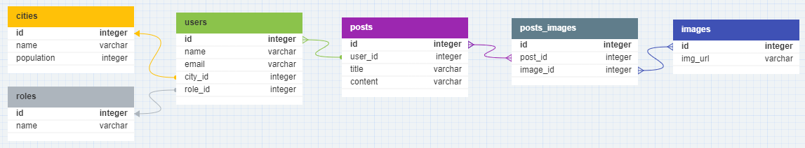
- It is a blog database with six tables

---

<!-- _class: invert -->
<style scoped>
.language-sql {
  font-size: 120%;
}
</style>

## The `LIMIT` clause

- To limit the results returned, we can append the `LIMIT` keyword in a query, followed by the maximum number of results expected:

```sql
SELECT * FROM table_name LIMIT 5;
```

- When in doubt of the size of a table, it is a good practice to put a limit in the results to prevent slow queries (imagine querying a table with _thousands_ of rows 😅)

---

<!-- _class: invert -->
<style scoped>
.language-sql {
  font-size: 120%;
}
</style>

## The `LIMIT` clause

- Seeing the query in practice:

```sql
blog=# SELECT * FROM users LIMIT 5;
 id |  name   |       email       | city_id | role_id
----+---------+-------------------+---------+---------
  1 | Viviana | viviana@email.com |       5 |       1
  2 | Callan  | callan@email.com  |       2 |       2
  3 | Aila    | aila@email.com    |       5 |       1
  4 | Moses   | moses@email.com   |       2 |       1
  5 | Amelia  | amelia@email.com  |       3 |       2
(5 rows)
```

---

<!-- _class: invert -->
<style scoped>
.language-sql {
  font-size: 120%;
}
</style>

## The `WHERE` clause

- Another way we can refine SQL queries is using the `WHERE` keyword:

```sql
SELECT * FROM table_name
WHERE condition;
```

- The `condition` can vary a lot. Some examples are:
  - a numeric column is greater than some value
  - a column is not null
  - and so on...

---

<!-- _class: invert -->
<style scoped>
.language-sql {
  font-size: 140%;
}
</style>

## The `WHERE` clause

- In the `LIMIT` example, there was a column `role_id` with different values (1 and 2). Let's filter only the rows where the column `role_id` is equal to 2:

```sql
SELECT * FROM users
WHERE role_id=2;
```

---

<!-- _class: invert -->
<style scoped>
.language-sql {
  font-size: 120%;
}
</style>

## The `WHERE` clause

```sql
blog=# SELECT * FROM users WHERE role_id=2;
 id |  name  |      email       | city_id | role_id
----+--------+------------------+---------+---------
  2 | Callan | callan@email.com |       2 |       2
  5 | Amelia | amelia@email.com |       3 |       2
(2 rows)
```

- We can see there are two users with the `role_id` equal to 2

---

<!-- _class: invert -->
<style scoped>
.language-sql {
  font-size: 120%;
}
</style>

## The `ORDER BY` clause

- If we want to specify how the results should be organized, we can use the `ORDER BY` statement:

```sql
SELECT * FROM table_name
ORDER BY column ASC;
```

- The `ASC` (default) keyword orders the results in **asc**ending order
- The `DESC` keyword orders the result in **desc**ending order

---

<!-- _class: invert -->
<style scoped>
.language-sql {
  font-size: 140%;
}
</style>

## The `ORDER BY` clause

- Let's order the cities stored in table `cities` based on the `population` column, from the most inhabited to the least inhabited:

```sql
SELECT * FROM cities
ORDER BY population DESC;
```

---

<!-- _class: invert -->
<style scoped>
.language-sql {
  font-size: 120%;
}
</style>

## The `ORDER BY` clause

```sql
blog=# SELECT * FROM cities ORDER BY population DESC;
 id |      name      | population
----+----------------+------------
  1 | São Paulo      |   12396372
  2 | Rio de Janeiro |    6775561
  3 | Brasília       |    3094325
  4 | Salvador       |    2900319
  5 | Fortaleza      |    2703391
(5 rows)
```

---

<style scoped>
li {
  font-size: 80%;
}
</style>

# Joining Tables

- We have seen how to filter results with `WHERE` and ordering with `ORDER`, and we also know how to create _relations_ using `FOREIGN KEY`s.

- But until now, we only get results from a single table 😔
- That makes it hard to truly understand some data, for example:
  - What is the actual role of users with `role_id=2`?
  - Who is the author of posts with `user_id=5`?
  - What are the cities with the highest number of blog posts?

---

# Joining Tables

- To answer all those questions we are going to use the `JOIN` statement.

- SQL joins allow us to combine two or more tables based on a condition, which usually is a pair of columns that are equal on the tables being joined (_equi JOINs_)

- It **is** possible to join with non-equal conditions (_non-equi JOINs_)

---

<!-- _class: invert -->

# The `JOIN` statemnet

## `LEFT JOIN`

- The `LEFT JOIN` clause returns _all_ the values from the "left" table and also the values from the "right" table where the _join condition_ is met.

- Let's use a Venn diagram to visualize it better...

---

<!-- _class: invert -->

# The `JOIN` statemnet

## `LEFT JOIN`

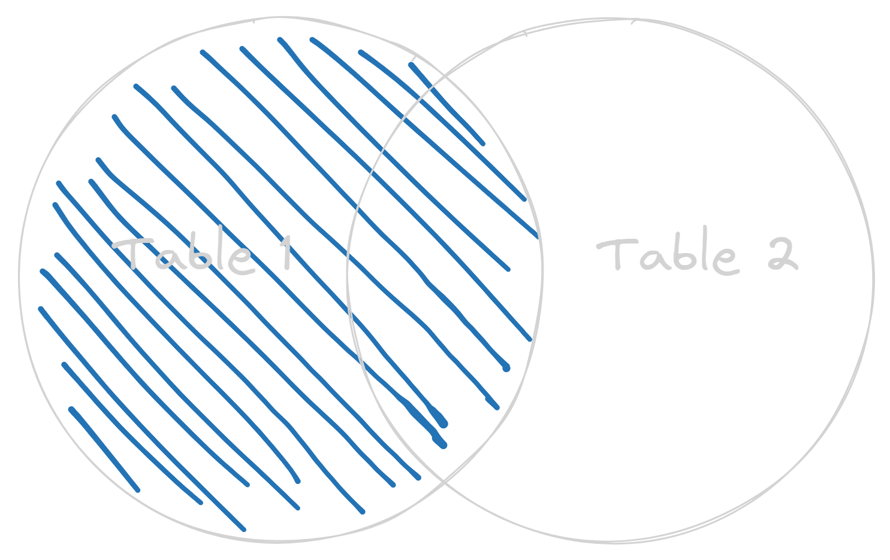

---

<!-- _class: invert -->

# The `JOIN` statemnet

## `LEFT JOIN`

- The basic syntax is:

```sql
SELECT table_one.column_name, table_two.column_name
FROM table_one
LEFT JOIN table_two
ON condition;
```

 <!-- We have to define which columns to be returned, but since there might be columns with the same name in different tables, we also need to specify the table name along with the column name. The condition may vary but usually is a equality between the columns used to create the relationships -->

---

<!-- _class: invert -->

# The `JOIN` statemnet

## `LEFT JOIN`

- Cheking what is the actual role of the users:

```sql
SELECT users.name, roles.name
FROM users
LEFT JOIN roles
ON users.role_id = roles.id
LIMIT 5;
```

---

<!-- _class: invert -->

# The `JOIN` statemnet

## `LEFT JOIN`

- Cheking what is the actual role of the users:

```sql
  name   | name
---------+-------
 Viviana | admin
 Callan  | basic
 Aila    | admin
 Moses   | admin
 Amelia  | basic
(5 rows)
```

---

<!-- _class: invert -->

# The `JOIN` statemnet

## `LEFT JOIN`

- To improve readability or simplify, we can use the `AS` clause to rename both the elements of the query and the columns returned:

```sql
SELECT u.name, r.name AS role
FROM users AS u
LEFT JOIN roles AS r
ON u.role_id = r.id
LIMIT 5;
```

---

<!-- _class: invert -->
<style scoped>
  li {
    font-size: 70%;
  }
  </style>

# The `JOIN` statemnet

## `LEFT JOIN`

- To improve readability or simplify, we can use the `AS` clause to rename both the elements of the query and the columns returned:

```sql
  name   | role
---------+-------
 Viviana | admin
 Callan  | basic
 Aila    | admin
 Moses   | admin
 Amelia  | basic
(5 rows)
```

---

<style scoped>
  li {
    font-size: 80%;
  }
</style>

## The `JOIN` statemnet

### `LEFT JOIN`

- In the example used, the results were limited to 5 rows using the `LIMIT 5` statement.

- But even if the results were not limited, all the users would have a matching role (you can check it yourself 😉).

- If there were a user **without** a `role_id` defined (not possible because of the constraint `NOT NULL`), then the `role` column would be `NULL`

---

<!-- _class: invert -->

# The `JOIN` statemnet

## `LEFT JOIN` (excluding)

- The excluding `LEFT JOIN` returns all the values from the left table that **do not have** a matching row in the right table.

- Let's use a Venn diagram once again...

---

<!-- _class: invert -->

# The `JOIN` statemnet

## `LEFT JOIN` (excluding)

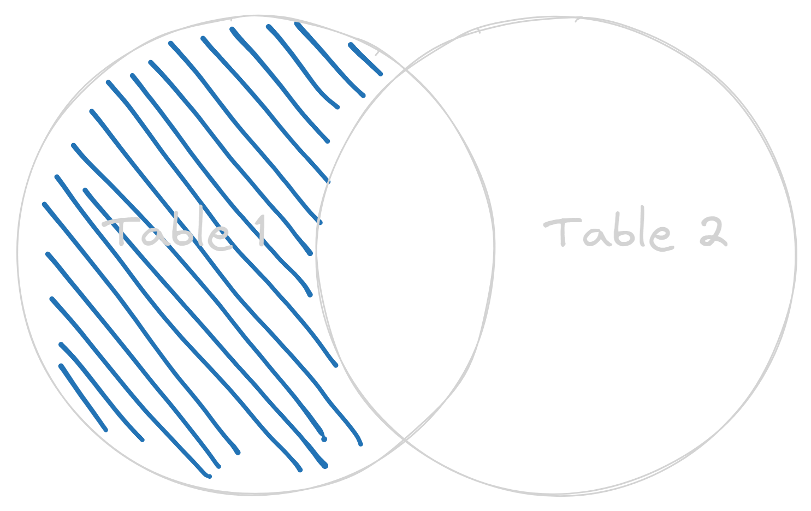

---

<!-- _class: invert -->

# The `JOIN` statemnet

## `LEFT JOIN` (excluding)

- The basic syntax is:

```sql
SELECT table_one.column_name, table_two.column_name
FROM table_one
LEFT JOIN table_two
ON table_one.column_name = table_two.column_name;
WHERE table_two.column_name IS NULL;
```

 <!-- The difference here is that we add a WHERE clause that filters only results where the column from the right table is NULL. -->

---

<!-- _class: invert -->

# The `JOIN` statemnet

## `LEFT JOIN` (excluding)

- Fetching all the posts that do not have an image attached:

```sql
SELECT p.title, p_i.id
FROM posts as p
LEFT JOIN posts_images as p_i
ON p.id = p_i.post_id
WHERE p_i.id IS NULL;
```

---

<!-- _class: invert -->
<style scoped>
li {
  font-size: 28px;
}
code {
  font-size: 70%;
}
</style>

### `LEFT JOIN` (excluding)

- Fetching all the posts that do not have an image attached:

```
                             title                              | id
----------------------------------------------------------------+----
 Fallen Angel : Fact versus Fiction                             |
 Can Blue Bottles Dance : An exploration of Memes               |
 How to Make Your Own Admirable Dress for less than £5          |
 Mickey Mouse - 10 Best Moments                                 |
 From Zero to Shape Shifter - Makeover Tips                     |
 7 Unmissable YouTube Channels About Thoughts                   |
 7 Pictures of Rihanna That We Would Rather Forget              |
 How to Attract More Admirable Subscribers                      |
 10 Awesome Ways to Photograph Blue Bottles                     |
 Introducing programmer - Who Am I And Why Should You Follow Me |
 10 Things Mickey Mouse Can Teach Us About Thoughts             |
 Snakes Are the New Black                                       |
 Blue Bottles Are the New Black                                 |
 The Week: Top Stories About Rihanna                            |
 How to Increase Your Income Using Just Your Knees.             |
 10 Awesome Ways to Photograph Snakes                           |
 7 Pictures of Paul McCartney That We Would Rather Forget       |
 How to Increase Your Income Using Just Your Ankles.            |
 20 Dress Reviews in Tweet Form                                 |
(19 rows)
```

---

<!-- _class: invert -->

# The `JOIN` statemnet

## `RIGHT JOIN`

- The `RIGHT JOIN` works (as you may have guessed) just like the `LEFT JOIN` but in this case the results returned are from the right table.

- Let's use a Venn diagram to visualize it better...

---

<!-- _class: invert -->

# The `JOIN` statemnet

## `RIGHT JOIN`

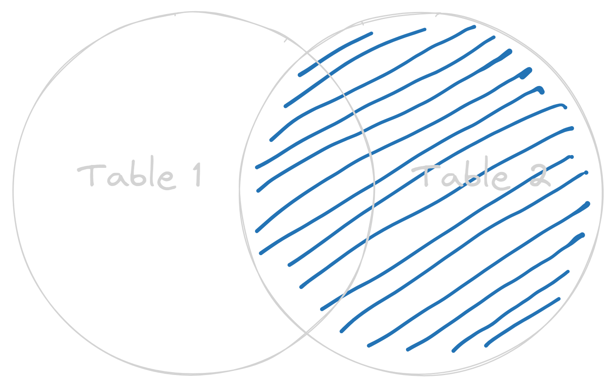

---

<!-- _class: invert -->

# The `JOIN` statemnet

## `RIGHT JOIN` (excluding)

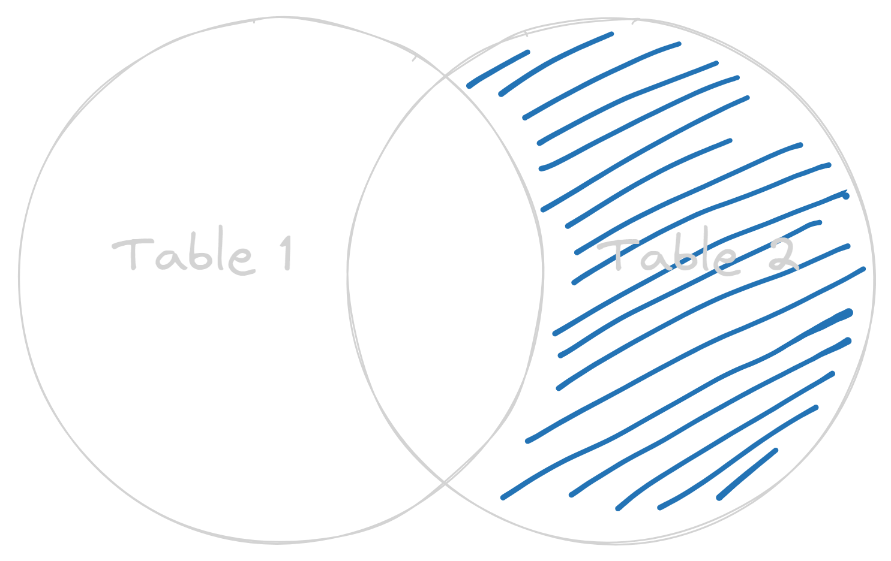

---

<!-- _class: invert -->

# The `JOIN` statemnet

## `RIGHT JOIN`

```sql
SELECT table_one.column_name, table_two.column_name
FROM table_one
RIGHT JOIN table_two
ON table_one.column_name = table_two.column_name;
```

---

<!-- _class: invert -->

# The `JOIN` statemnet

## `RIGHT JOIN` (excluding)

```sql
SELECT table_one.column_name, table_two.column_name
FROM table_one
RIGHT JOIN table_two
ON table_one.column_name = table_two.column_name;
WHERE table_one.column_name IS NULL;
```

---

<!-- _class: invert -->

# The `JOIN` statemnet

## `INNER JOIN`

- Another type of SQL join is the `INNER JOIN` and in this case, the results returned are the ones that have values defined in **both** tables, _i.e._, the intersection between the tables based on a given condition.

---

<!-- _class: invert -->

# The `JOIN` statemnet

## `INNER JOIN`

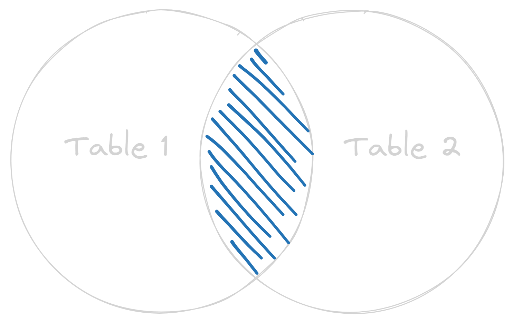

---

<!-- _class: invert -->

# The `JOIN` statemnet

## `INNER JOIN`

```sql
SELECT table_one.column_name, table_two.column_name
FROM table_one
INNER JOIN table_two
ON table_one.column_name = table_two.column_name;
```

---

<!-- _class: invert -->

# The `JOIN` statemnet

## `INNER JOIN`

- Let's fetch the users and the cities they live:

```sql
SELECT users.name, cities.name AS city
FROM users
INNER JOIN cities
ON users.city_id = cities.id
LIMIT 15;
```

---

<!-- _class: invert -->
<style scoped>
li {
  font-size: 28px;
}
code {
  font-size: 80%;
}
</style>

## `INNER JOIN`

Let's fetch the users and the cities they live:

```sql
   name   |      city
----------+----------------
 Viviana  | Fortaleza
 Callan   | Rio de Janeiro
 Aila     | Fortaleza
 Moses    | Rio de Janeiro
 Amelia   | Brasília
 Chandler | Fortaleza
 Alicia   | Salvador
 Nehemiah | Fortaleza
 Everly   | Salvador
 Kayson   | Brasília
 Imani    | Brasília
 Jamie    | São Paulo
 Ximena   | São Paulo
 Alexis   | Rio de Janeiro
 Estrella | São Paulo
(15 rows)
```

---

<!-- _class: invert -->

# The `JOIN` statemnet

## `INNER JOIN`

- But is there any city without users associated with?

```sql
SELECT cities.name AS city, users.name
FROM users
RIGHT JOIN cities
ON users.city_id = cities.id
WHERE city IS NULL;
```

<!-- Using a RIGHT JOIN (excluding) to check if there is any city without users associated -->

---

<!-- _class: invert -->

# The `JOIN` statemnet

```sql
blog=# SELECT cities.name AS city, users.name
blog-# FROM users RIGHT JOIN cities
blog-# ON users.city_id = cities.id
blog-# WHERE users.city_id IS NULL;
      city      | name
----------------+------
 Belo Horizonte |
 Manaus         |
 Curitiba       |
 Recife         |
 Goiânia        |
(5 rows)
```

---

<!-- _class: invert -->

# The `JOIN` statemnet

- There is also another type of `JOIN` which fetches **all** the rows from **both** the left and right tables

- This is the `FULL JOIN` and it is basically a `LEFT JOIN`and `RIGHT JOIN` "combined".

---

<!-- _class: invert -->

# The `JOIN` statemnet

## `FULL OUTER JOIN`

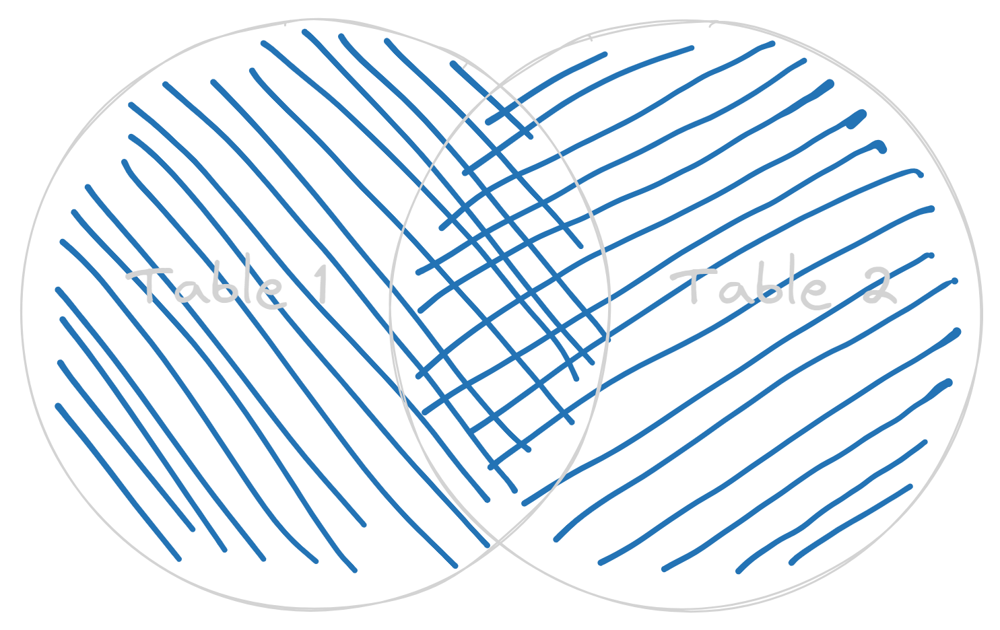

---

<!-- _class: invert -->

# The `JOIN` statemnet

## `FULL OUTER JOIN` (excluding)

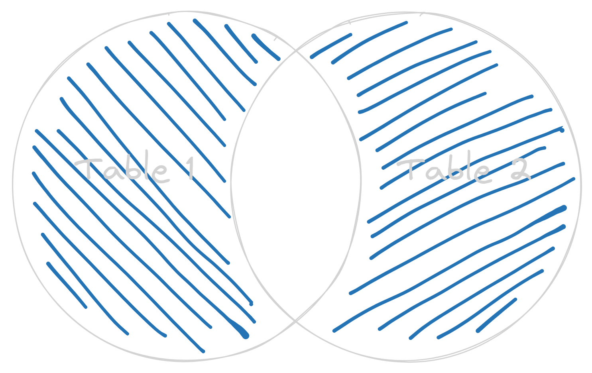

---

<!-- _class: invert -->

# The `JOIN` statemnet

## `FULL OUTER JOIN`

```sql
SELECT table_one.column_name, table_two.column_name
FROM table_one
FULL OUTER JOIN table_two
ON table_one.column_name = table_two.column_name;
```

---

<!-- _class: invert -->

# The `JOIN` statemnet

## `FULL OUTER JOIN` (excluding)

```sql
SELECT table_one.column_name, table_two.column_name
FROM table_one
FULL OUTER JOIN table_two
ON table_one.column_name = table_two.column_name;
WHERE table_one.column_name IS NULL OR table_two.column_name IS NULL;
```

---

# The `JOIN` statement

- There is also another type of join called `CROSS JOIN` which returns the [cartesian product](https://en.wikipedia.org/wiki/Cartesian_product) based on the condition, but it has very specific use cases.

- SQL joins can be "chained", _i.e._, the result of one `JOIN` operation is joined to another table. Let's see one example...

---

<!-- _class: invert -->

# The `JOIN` statement

- In the `blog` database being used for the examples we have a _many-to-many_ relationship between the `posts` and `images` tables that is achieved **through** the `posts_images` _junction_ table.

- What if we want to list the images URL for each of the posts that have at least one image attached?

---

<!-- _class: invert -->

# The `JOIN` statement

- We can achieve that with the following steps:

  1. Do a `INNER JOIN` between the tables `posts` and `posts_images`
  2. Do another `INNER JOIN` between the results and the `images` table.

---

<!-- _class: invert -->

# The `JOIN` statement

- Results goal:

| Post ID | Title      | Images            |
| ------- | ---------- | ----------------- |
| 1       | How to SQL | www.images.com/12 |
| 1       | How to SQL | www.images.com/34 |
| 3       | Git 101    | www.images.com/5  |
| ...     | ...        | ...               |

---

<!-- _class: invert -->
<style scoped>
.language-sql {
  font-size: 150%;
}
</style>

# The `JOIN` statement

### Step 1:

```sql
SELECT posts.id AS "Post ID", posts.title AS "Title"
FROM posts
INNER JOIN posts_images
ON posts.id = posts_images.post_id;
```

---

<!-- _class: invert -->
<style scoped>
.language-sql {
  font-size: 90%;
}
</style>

#### The `JOIN` statement

```
 Post ID |                         Title
---------+-------------------------------------------------------
      19 | 10 Things Mickey Mouse Can Teach Us About Thoughts
      12 | Mickey Mouse - 10 Best Moments
      24 | 21 Myths About Blue bottles Debunked
      12 | Mickey Mouse - 10 Best Moments
      11 | How to Make Your Own Admirable Dress for less than £5
      21 | 10 Awesome Ways to Photograph Blue Bottles
      27 | Can Blue Bottles Dance : An exploration of Memes
      13 | How to Attract More Admirable Subscribers
      28 | Blue Bottles Are the New Black
      10 | From Zero to Shape Shifter - Makeover Tips
      23 | How to Increase Your Income Using Just Your Knees.
      19 | 10 Things Mickey Mouse Can Teach Us About Thoughts
      27 | Can Blue Bottles Dance : An exploration of Memes
      23 | How to Increase Your Income Using Just Your Knees.
       2 | 7 Pictures of Rihanna That We Would Rather Forget
      13 | How to Attract More Admirable Subscribers
(16 rows)
```

---

<!-- _class: invert -->
<style scoped>
.language-sql {
  font-size: 150%;
}
</style>

# The `JOIN` statement

### Step 2:

```diff
- SELECT posts.id AS "Post ID", posts.title AS "Title"
+ SELECT posts.id AS "Post ID", posts.title AS "Title", images.img_url as "Images"
FROM posts_images
INNER JOIN posts
ON posts_images.post_id = posts.id
+ INNER JOIN images
+ ON posts_images.image_id = images.id
+ ORDER BY posts.id;
```

---

<!-- _class: invert -->
<style scoped>
.language-sql {
  font-size: 90%;
}
</style>

#### The `JOIN` statement

```
 Post ID |                             Title                              |          Images
---------+----------------------------------------------------------------+--------------------------
       4 | 21 Myths About Snakes Debunked                                 | https://onlink.site/yQCF
       4 | 21 Myths About Snakes Debunked                                 | https://onlink.site/iVhX
       4 | 21 Myths About Snakes Debunked                                 | https://onlink.site/93iP
       5 | Introducing programmer - Who Am I And Why Should You Follow Me | https://onlink.site/AuUT
       5 | Introducing programmer - Who Am I And Why Should You Follow Me | https://onlink.site/93iP
       7 | Can Snakes Dance : An exploration of Memes                     | https://onlink.site/YMrl
       8 | Snakes Are the New Black                                       | https://onlink.site/AuUT
      12 | Mickey Mouse - 10 Best Moments                                 | https://onlink.site/yQCF
      16 | The Week: Top Stories About Rihanna                            | https://onlink.site/iVhX
      20 | Mistakes That Snakes Make and How to Avoid Them                | https://onlink.site/AuUT
      20 | Mistakes That Snakes Make and How to Avoid Them                | https://onlink.site/93iP
      22 | 7 Pictures of Paul McCartney That We Would Rather Forget       | https://onlink.site/iVhX
      23 | How to Increase Your Income Using Just Your Knees.             | https://onlink.site/93iP
      25 | Introducing database - Who Am I And Why Should You Follow Me   | https://onlink.site/AuUT
      25 | Introducing database - Who Am I And Why Should You Follow Me   | https://onlink.site/YMrl
      26 | Fallen Angel : Fact versus Fiction                             | https://onlink.site/YMrl
(16 rows)
```

<!-- That way we achieve our goal! -->

---

# Querying with SQL

- We have already seen how to filter the resulst and order them (and join tables too!)

- We still have to learn how to generate analytics (at least one way of doing that)

- And that way is using the `GROUP BY` clause...

---

<!-- _class: invert -->

## The `GROUP BY` statement

- We use `GROUP BY` to _group_ rows using an _aggregate function_ on one or more columns.

- Some of the possible aggregate functions are:

  - `COUNT()` - returns the number of rows that meet the condition

  - `MAX()`, `MIN()` and `AVG()` - return the maximum, minimum and average of the values

  - `SUM()` - returns the sum of the values

---

<!-- _class: invert -->

## The `GROUP BY` statement

- With `GROUP BY` we can answer:

  - How many users live in the most inhabited city from the `cities` table?

  - Who is the user with most posts?

---

<!-- _class: invert -->
<style scoped>
  .language-sql {
    font-size: 150%;
  }
</style>

# The `GROUP BY` statement

Basic syntax:

```sql
SELECT AGG(column_name_one), column_name_two
FROM table_name
GROUP BY column_name_two;
```

- Where `AGG()` is an [aggregate function](https://www.postgresql.org/docs/15/functions-aggregate.html)

---

<!-- _class: invert -->
<style scoped>
  .language-sql {
    font-size: 150%;
  }
</style>

# The `GROUP BY` statement

Let's start with a query using a single table:

```sql
SELECT COUNT(image_id), post_id
FROM posts_images
GROUP BY post_id
ORDER BY count DESC;
```

---

<!-- _class: invert -->

<style scoped>
  li {
     font-size: 70%;
  }
  .language-sql {
    font-size: 100%;
  }
</style>

### The `GROUP BY` statement

- The result shows the posts ordered by the number of images attached:

```sql
 count | post_id
-------+---------
     3 |       4
     2 |      25
     2 |      20
     2 |       5
     1 |      12
     1 |      23
     1 |      22
     1 |       8
     1 |      26
     1 |      16
     1 |       7
(11 rows)
```

---

<!-- _class: invert -->
<style scoped>
  .language-sql {
    font-size: 150%;
  }
</style>

# The `GROUP BY` statement

But we can use `GROUP BY` on joins too:

```sql
SELECT COUNT(users.id) AS "Users" , cities.name AS "City"
FROM users
INNER JOIN cities
ON users.city_id = cities.id
GROUP BY cities.name
ORDER BY "Users" DESC;
```

---

<!-- _class: invert -->
<style scoped>
  .language-sql {
    font-size: 150%;
  }
</style>

# The `GROUP BY` statement

And get the number of users per city:

```sql
 Users |      City
-------+----------------
     9 | Salvador
     7 | Brasília
     6 | Fortaleza
     5 | São Paulo
     3 | Rio de Janeiro
(5 rows)
```

---

# Nice Job! :tada:

If you got this far, you already know the core concepts and can do A LOT of things with SQL :sunglasses:

---

# Entering the next level

The next slides will introduce more advanced concepts, all of them are very powerful, and let us make our databases more robust and performant

---

# Entering the next level

- **Subqueries**: using queries within queries.
- **Views**: virtual tables for simplified querying.
- **Indexes**: optimizing data retrieval.
- **Transactions**: ensuring data consistency.
- **Multi-tenancy**: how to separate user environments.

---

<!-- _class: invert -->

# Subqueries

---

<!-- _class: invert -->

## Subqueries

- _Subqueries_ (also called _inner queries_) are used to query data "inside" another query.

- For instance, we may use subqueries to filter out rows before making a `JOIN` statement, or to define values to be used in thw `WHERE` clause.

- Let's see an example to better understand the concept!

---

<!-- _class: invert -->

## Subqueries

- The basic syntax of subqueries is quite simple, just wrap a regular query in parenthesis:

```sql
SELECT column1, column2
FROM table_name1
WHERE condition
    (SELECT column1, column2
     FROM table_name2);
```

---

<!-- _class: invert -->

## Subqueries

- Here's an example using the same blog dataset used in the "Querying" section

- In this example the query will use a subquery to get all the posts that have authors with names that start with letter "A"

- This query does not look too useful, but it's just an example

---

<!-- _class: invert -->

## Subqueries

- The subquery will look like this:

```sql
SELECT id
FROM users
WHERE name LIKE 'A%';
```

---

<!-- _class: invert -->

## Subqueries

```
 id 
----
  3
  5
  7
 14
 17
 21
 24
 26
(8 rows)
```

---

<!-- _class: invert -->

## Subqueries

- Great! Now, we can use the values returned to filter the `posts` table:

```sql
SELECT id,title
FROM posts
WHERE user_id IN
    (SELECT id
    FROM users
    WHERE name LIKE 'A%');
```

---

<!-- _class: invert -->

## Subqueries

```
 id |                            title
----+--------------------------------------------------------------
  9 | 20 Dress Reviews in Tweet Form
 11 | How to Make Your Own Admirable Dress for less than £5
 15 | Unboxing My New Shape Shifter Poo
 18 | 7 Unmissable YouTube Channels About Thoughts
 22 | 7 Pictures of Paul McCartney That We Would Rather Forget
 25 | Introducing database - Who Am I And Why Should You Follow Me
 26 | Fallen Angel : Fact versus Fiction
 28 | Blue Bottles Are the New Black
 29 | 20 Hat Reviews in Tweet Form
 30 | From Zero to Fallen Angel - Makeover Tips
(10 rows)
```

---

<!-- _class: invert -->

## Subqueries

- The previous example was quite simple, but subqueries are very powerful and can be used more than once in a single query

- One important thing to notice is that subqueries are somewhat similar to joins. The same results can be achieved with both features. But a "rule of thumb" is to use subqueries to define _conditions_.

---

<!-- _class: invert -->

# Views

---

<!-- _class: invert -->

## Views

Let's remember one query we've used before to list blog posts titles along with their images

```sql
SELECT posts.id AS "Post ID",
    posts.title AS "Title",
    images.img_url as "Images"
FROM posts_images
    INNER JOIN posts ON posts_images.post_id = posts.id
    INNER JOIN images ON posts_images.image_id = images.id
ORDER BY posts.id;
```

---


<!-- _class: invert -->

## Views

We can create a _view_ to use the data returned exactly as a table. It has a few benefits:

1. Simplifies complex queries
2. Can limit what data is shared with users
3. Provides more meaningful/readable column names
4. Can be used as a step in a really complex query

---

<!-- _class: invert -->

## Views

- When creating views, we must provide a name to it
- View do **not** persist data anywhere, so when querying from a view the underlying query will be executed too

---

<!-- _class: invert -->

## Views

Basic syntax:

```sql
CREATE VIEW view_name AS
-- query to be saved
```

---

<!-- _class: invert -->

## Views

Using the example shown before:

```sql
CREATE VIEW vw_post_titles_images AS
SELECT posts.id AS post_id,
    posts.title AS post_title,
    images.img_url as image_link
FROM posts_images
    INNER JOIN posts ON posts_images.post_id = posts.id
    INNER JOIN images ON posts_images.image_id = images.id
ORDER BY posts.id;
```

---

<!-- _class: invert -->

## Views

After creating the view, we can query as usual:

```
blog=# SELECT * FROM vw_post_titles_images LIMIT 5;
 post_id |                      post_title                       |        image_link        
---------+-------------------------------------------------------+--------------------------
       6 | Shape Shifter : Fact versus Fiction                   | https://onlink.site/yQCF
       9 | 20 Dress Reviews in Tweet Form                        | https://onlink.site/93iP
      10 | From Zero to Shape Shifter - Makeover Tips            | https://onlink.site/YMrl
      10 | From Zero to Shape Shifter - Makeover Tips            | https://onlink.site/93iP
      11 | How to Make Your Own Admirable Dress for less than £5 | https://onlink.site/yQCF
(5 rows)
```

---

<!-- _class: invert -->

# Indexes

---

<!-- _class: invert -->

# Transactions

---

<!-- _class: invert -->

# Multi-tenancy

---

<!-- _class: invert -->

# Agenda

-  **~~SQL~~**

-  **ORMs**
  - Definition, popular ORMs and examples
-  **Best Practices and Tips**
  - Performance, security and debugging

<!-- With the SQL part complete, let's dive in ORMs -->

---


# ORM

**O**bject **R**elational **M**apping

<!-- So what is ORM? It stands for object relational mapping. -->

---

#  ORM

### What is an ORM?

ORM is a technique that uses _object-oriented programming_ to interact with databases.

 <!-- Presenter notes. -->

---

<!-- _class: invert -->

<style scoped>
  table {
    font-size: 80%;
  }
  </style>

##### Here is a list of ORM libraries for different languages

|                                    **Language**                                    |        **ORM Libraries**         |
| :--------------------------------------------------------------------------------: | :------------------------------: |
|  NodeJS |       Sequelize<br>Prisma        |
|  Python | SQLAlchemy<br>Django<br>SQLModel |
|      Go     |           GORM<br>REL            |
|    Java   |     Hibernate<br>EclipseLink     |
|    C#   |       Entity<br>NHibernate       |
|                                                                                    |                                  |

---

<!-- _class: invert -->

# An Example With Go

Let's build a simple HTTP server that returns a random motivational quote.

We can start with the implementation of the endpoint `/quote` with a hard coded value.

---

<!-- _class: invert -->

Starter code: `main.go`

```go
package main

import (
  "log"
  "net/http"
)

func quoteHandler(w http.ResponseWriter, r *http.Request) {
  w.Header().Set("Content-Type", "text/plain")
  w.Write([]byte("Nothing is impossible.\n"))
}

func main() {
  http.HandleFunc("/quote", quoteHandler)

  log.Println("Listening on port 8080")
  log.Fatal(http.ListenAndServe(":8080", nil))
}
```

---

<!-- _class: invert -->

### An Example With Go

- We can spin up the server:

```
$ go run main.go
2023/06/30 00:53:16 Listening on port 8080
```

And make a request:

```
$ curl http://localhost:8080/quote
Nothing is impossible.
```

---

<!-- _class: invert -->

### An Example With Go

- Awesome! We've got our first quote.

- But we will need more quotes to randomize the reponse.

- To do that, instead of a single hardcoded quote, let's create a list of quotes.

---

<!-- _class: invert -->

```go
import (
  "log"
  "math/rand"
  "net/http"
)

var quotes = []string{
  "Nothing is impossible.\n",
  "If you're going through hell, keep going.\n",
  "We need much less than we think we need.\n",
  "If things go wrong, don't go with them.\n",
  "Whatever you are, be a good one.\n",
}

func quoteHandler(w http.ResponseWriter, r *http.Request) {
  index := rand.Intn(len(quotes))
  quote := quotes[index]
  w.Header().Set("Content-Type", "text/plain")
  w.Write([]byte(quote))
}

```

---

<!-- _class: invert -->

### An Example With Go

- Running the server again:

```
$ go run main.go
2023/06/30 00:53:16 Listening on port 8080
```

And making a few requests:

```
$ curl http://localhost:8080/quote
Whatever you are, be a good one.
$ curl http://localhost:8080/quote
If you're going through hell, keep going.
$ curl http://localhost:8080/quote
Nothing is impossible.
```

---

<!-- _class: invert -->

### An Example With Go

- Beautiful! We already are returning random quotes.
- But... this will not scale well, of course. What if we want to store hundreds or even thousands of quotes? :thinking:
- That's when a database comes in handy. In the next step, we are going to connect to a PostgreSQL database so we can separate the concerns.

---

<!-- _class: invert -->

### An Example With Go

<div class="columns red">
<div class="border-right-white">
Current


</div>
<div>
Goal


</div>
</div>

---

<!-- _class: invert -->

### An Example With Go

- In the diagram showed, the Go server and the PostgreSQL server are different services, but will not necessarely run on different computers.

- Before we connect to the database, the database must be ready to receive connections.

- We're going to see how to do it, it is quite simple!

---

<!-- _class: invert -->

### An Example With Go

1. If not installed already, install [PostgreSQL](https://www.postgresql.org/download/)
2. Create a database called `quotes_db` and connect to it:

```bash
psql
DROP DATABASE IF EXISTS quotes_db;
CREATE DATABASE quotes_db;
\c quotes_db
```

---

<!-- _class: invert -->

### An Example With Go

3. Create a table called `quotes` and add some values:

```sql
CREATE TABLE quotes (id serial PRIMARY KEY, quote varchar NOT NULL);
INSERT INTO quotes(quote)
VALUES ('Nothing is impossible'),
    ('If you`re going through hell, keep going'),
    ('We need much less than we think we need'),
    ('If things go wrong, don`t go with them'),
    ('Whatever you are, be a good one');
```

---

<!-- _class: invert -->

### An Example With Go

Here is the data stored ready to be fetched:

```
$ psql quotes_db
quotes_db=# SELECT * FROM quotes;
 id |                  quote
----+------------------------------------------
  1 | Nothing is impossible
  2 | If you`re going through hell, keep going
  3 | We need much less than we think we need
  4 | If things go wrong, don`t go with them
  5 | Whatever you are, be a good one
(5 rows)
```

---

<!-- _class: invert -->

### An Example With Go

- Instead of using `psql` we want to query the database **from the server**.
- To achieve that we need to _connect_ to the database (DB) and then _do the query_ to get a quote and return it in the response.

---

<!-- _class: invert -->

### An Example With Go

- To connect to the DB we are going to use the `database/sql` native Go package and also a PostgreSQL [driver](https://github.com/golang/go/wiki/SQLDrivers). In this example, [`lib/pq`](https://github.com/lib/pq).

```
go mod init go-sql-example
go get -u github.com/lib/pq
```

---

<!-- _class: invert -->
<style scoped>
li {
  font-size: 28px;
}
.language-go {
  font-size:65%;
}
</style>

#### An Example With Go

- Next, let's update the code to create the DB connection:

```go
import (
  "database/sql"
  "log"
  "math/rand"
  "net/http"

  _ "github.com/lib/pq"
)

var db *sql.DB

func init() {
  connStr := "postgresql://localhost/quotes_db?sslmode=disable"
  var err error
  db, err = sql.Open("postgres", connStr)
  if err != nil {
    log.Fatal("Failed to connect to database:", err)
  }

  err = db.Ping()
  if err != nil {
    log.Fatal("Failed to ping database:", err)
  }
  log.Println("Connected to the database")
}
```

---

<!-- _class: invert -->
<style scoped>
li {
  font-size: 32px;
}
.language-go {
  font-size:65%;
}
</style>

#### An Example With Go

- Testing the connection:

```bash
$ go run main.go
 2023/07/01 00:20:51 Connected to the database
 2023/07/01 00:20:51 Listening on port 8080
```

- Awesome, we are connected to the DB. Now we can query the table with quotes!

---

<!-- _class: invert -->
<style scoped>
li {
  font-size: 32px;
}
.language-go {
  font-size:65%;
}
</style>

#### An Example With Go

- First, we have to define what the query will be. We can either:

  1. Get a list of quotes and randomize the response in the Go server
  2. Get a single random quote from the database

- With option 1 we have a problem: there is a limit on how many quotes we can fetch at once, and it would be really slow and inefficient to ingest several quotes to return just one.
- In option 2 we would have a problem if there was no way to get a random quote from the DB. But as you might have noticed, SQL databases are very flexible and feature-rich. Getting random values is quite easy :tada:

---

<!-- _class: invert -->
<style scoped>
li {
  font-size: 32px;
}
.language-sql {
  font-size:150%;
}
</style>

#### An Example With Go

- The query will look like this:

```sql
SELECT quote FROM quotes ORDER BY RANDOM() LIMIT 1;
```

- The `ORDER BY RANDOM()` makes the result random and the `LIMIT 1` clause returns only one result.

- Now we just have to update the Go code and assign this result to one variable to return it in the response...

---

<!-- _class: invert -->
<style scoped>
li {
  font-size: 28px;
}
.language-go {
  font-size:90%;
}
</style>

##### An Example With Go

- Add the `getRandomQuote` function to return the result:

```go
func getRandomQuote() (string, error) {
  rows, err := db.Query("SELECT quote FROM quotes ORDER BY RANDOM() LIMIT 1")
  if err != nil {
    return "", err
  }
  defer rows.Close()

  var quote string
  for rows.Next() {
    err := rows.Scan(&quote)
    if err != nil {
      return "", err
    }
  }

  return quote, nil
}
```

---

<!-- _class: invert -->

##### An Example With Go

- Update the `quoteHandler` function:

```go
func quoteHandler(w http.ResponseWriter, r *http.Request) {
  quote, err := getRandomQuote()
  if err != nil {
    log.Println("Failed to retrieve quote:", err)
    http.Error(w, "Internal Server Error", http.StatusInternalServerError)
    return
  }

  w.Header().Set("Content-Type", "text/plain")
  w.Write([]byte(quote))
}
```

---

<!-- _class: invert -->

##### An Example With Go

- Testing the server again:

```
go run main.go
2023/07/01 01:28:18 Connected to the database
2023/07/01 01:28:18 Listening on port 8080
```

```
$ curl http://localhost:8080/quote
Nothing is impossible
$ curl http://localhost:8080/quote
We need much less than we think we need
```

:tada: :tada: :tada:

---

### An Example With Go

- So far we have:
  - A Go HTTP server with a single route: `/quote` that returns a random quote.
  - A PostgreSQL server that stores the quotes in a database called `quotes_db`
  - The Go server fetches the quotes from the DB and returns to the client.

**What about the ORM?**

---

### An Example With Go

- Using an ORM is not mandatory. We could improve the example even more and use all the features of SQL using only the current stack.

- But... we can also use an ORM as an abstraction layer between the language we are using in the server (in this example, Go) and SQL.

- That way, we can remove (or at least reduce a lot) the usage of "raw" SQL.

---

<style scoped>
li {
  font-size: 32px;
}
</style>

### PROS and CONS

<div class="columns">
<div class="border-right-black">
<h5>Pros</h5>

- Models are DRY
- SQL injection is harder
- Simpler queries
- Migrations

</div>
<div>
<h5>Cons</h5>

- Complex queries
- Additional tech
- Obfuscates SQL behaviour

</div>
</div>

---

### An Example With Go

- Let's see how we would build the same quotes Go server using an ORM.

- For this example we will be using [GORM](https://gorm.io/)

---

<!-- _class: invert -->
<style scoped>
li {
  font-size: 32px;
}
.language-go {
  font-size: 70%;
}
</style>

### An Example With Go

- Once again, we start with a simple HTTP server with the `/quote` endpoint:

```go
package main

import (
  "log"
  "net/http"
)

func quoteHandler(w http.ResponseWriter, r *http.Request) {
  w.Header().Set("Content-Type", "text/plain")
  w.Write([]byte("Nothing is impossible.\n"))
}

func main() {
  http.HandleFunc("/quote", quoteHandler)

  log.Println("Listening on port 8080")
  log.Fatal(http.ListenAndServe(":8080", nil))
}
```

---

<!-- _class: invert -->
<style scoped>
li {
  font-size: 28px;
}

code {
  font-size: 150%;
}
</style>

### An Example With Go

- To connect to the DB we are going to use the `GORM` library with its PostgreSQL driver, [`gorm.io/driver/postgres`](https://github.com/go-gorm/postgres).

```
go mod init go-orm-example
go get -u gorm.io/gorm
go get -u gorm.io/driver/postgres
```

---

<!-- _class: invert -->

### An Example With Go

- In the example with Go and vanilla SQL we created the database `quotes_db` and added some data using `psql`.

- Here we are going to use `GORM` to do this step as well, so we can see how the DDL is translated to the ORM.

---

<!-- _class: invert -->

```go
// package, import ...
type Quotes struct {
  ID    uint `gorm:"primaryKey"`
  Quote string
}

var (
  initialQuotes = []Quotes{
    {Quote: "Nothing is impossible"},
    {Quote: "If you`re going through hell, keep going"},
    {Quote: "We need much less than we think we need"},
    {Quote: "If things go wrong, don`t go with them"},
    {Quote: "Whatever you are, be a good one"},
  }
)

func main() {
  dsn := "host=localhost dbname=quotes_db port=5432 sslmode=disable"
  db, err := gorm.Open(postgres.Open(dsn), &gorm.Config{})
  if err != nil {
    panic("failed to connect database")
  }

  db.AutoMigrate(&Quotes{})

  for _, quote := range initialQuotes {
    db.Create(&quote)
  }
}
```

<!-- Here's what the seed file looks like. -->

---

<!-- _class: invert -->
<style scoped>
  img {
    padding: 0;
    margin: 0;
  }
  .bottom-space {
  padding-top: 28px;
  padding-bottom: 28px;
}
</style>

<div class="columns">
<div>


```go
// package, import ...
type Quotes struct {
  ID    uint `gorm:"primaryKey"`
  Quote string
}

var (
  initialQuotes = []Quotes{
    {Quote: "Nothing is impossible"},
    {Quote: "If you`re going through hell, keep going"},
    {Quote: "We need much less than we think we need"},
    {Quote: "If things go wrong, don`t go with them"},
    {Quote: "Whatever you are, be a good one"},
  }
)

func main() {
  dsn := "host=localhost dbname=quotes_db port=5432 sslmode=disable"
  db, err := gorm.Open(postgres.Open(dsn), &gorm.Config{})
  if err != nil {
    panic("failed to connect database")
  }

  db.AutoMigrate(&Quotes{})

  for _, quote := range initialQuotes {
    db.Create(&quote)
  }
}
```

</div>
<div>

<div class="bottom-space">
SQL
</div>

```sql
CREATE TABLE quotes (id serial PRIMARY KEY, quote varchar NOT NULL);
INSERT INTO quotes(quote)
VALUES ('Nothing is impossible'),
    ('If you`re going through hell, keep going'),
    ('We need much less than we think we need'),
    ('If things go wrong, don`t go with them'),
    ('Whatever you are, be a good one');
```

</div>
</div>

<!-- Comparing to raw SQL (not including the creation of the database). As you can see, using Go, the code is more verbose. -->
<!-- At the same time, though, theres's nothing SQL in the code, it is "pure" Go. It uses structs, methods and Go types. -->

---

### An Example With Go

Now, let's update the server to query the database using `GORM`!

---

<!-- _class: invert -->
<style scoped>
  li {
    font-size: 28px;
  }
</style>

### An Example With Go

- First, we will declare a global variable `db` that holds the database connection, and declare the model used in this example:

```go
var db *gorm.DB

type Quotes struct {
  ID    uint `gorm:"primaryKey"`
  Quote string
}
```

- In order to make the code more DRY we could have used a different file to declare the model and use it both for the seed script and the server itself

---

<!-- _class: invert -->
<style scoped>
  .language-go {
    font-size: 150%;
  }
</style>

### An Example With Go

- Then we create a function to execute the database query:

```go
func getRandomQuote() (string, error) {
  var quote Quotes
  err := db.Order("RANDOM()").Take(&quote).Error
  if err != nil {
    return "", err
  }
  return quote.Quote, nil
}
```

---

<!-- _class: invert -->

### An Example With Go

- In the previous slide we have used the `db` variable (which has the `gorm.DB` type) to make the query.

- Two methods were called: `Order()` and `Take()`. The first one is directly related to the SQL statement `ORDER BY`.

- In the [`GORM` docs](https://gorm.io/docs/) we can find how to create models, associations, queries, and so on.

---

<!-- _class: invert -->
<style scoped>
  li {
    font-size: 28px;
  }
</style>

### An Example With Go

- Here are a few "equivalent" functions:

|    **GORM**    |   **SQL**    |
| :------------: | :----------: |
|   `Create()`   |   `INSERT`   |
|   `Where()`    |   `WHERE`    |
|   `Select()`   |   `SELECT`   |
|   `Order()`    |  `ORDER BY`  |
|   `Joins()`    | `LEFT JOIN`  |
| `InnerJoins()` | `INNER JOIN` |

---

<!-- _class: invert -->
<style scoped>
  li {
    font-size: 28px;
  }
</style>

### An Example With Go

- This does **not** mean that the ORM queries will look exactly like the SQL queries. Some SQL keywords are added to the query "behind the scenes". Here's another `GORM` example:

`db.First(&user)` is equivalent to

`SELECT * FROM users ORDER BY id LIMIT 1;`

---

<!-- _class: invert -->
<style scoped>
  li {
    font-size: 28px;
  }
  code {
    font-size: 90%;
  }
</style>

### An Example With Go

- Actually, `GORM` provides a method to get the resulting SQL query:

```go
sql := db.ToSQL(func(tx *gorm.DB) *gorm.DB {
  return tx.Order("RANDOM()").Take(&quote)
})
log.Println(sql)
```

Returns:

`SELECT * FROM "quotes" ORDER BY RANDOM() LIMIT 1`

- Quite similar to the query used in the Go + SQL example!

---

### CRUD with `GORM`

- Now, let's take another step and implement a GO API with `GORM` to do CRUD operations. Here's the schema to be implemented:

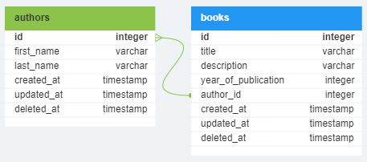

---

<!-- _class: invert -->

### CRUD with `GORM`

- It is a really simple schema to store books and authors with a single `one-to-many` relation (one author can have several books associated with them)

- The first step is to create the models using `GORM`

---

<!-- _class: invert -->

#### CRUD with `GORM`

- `models/authors.go`

```go
package model

import (
  "gorm.io/gorm"
)

type Author struct {
  gorm.Model
  FirstName string
  LastName  string
  Books     []Book
}
```

---

<!-- _class: invert -->

#### CRUD with `GORM`

- `models/books.go`

```go
package model

import (
  "gorm.io/gorm"
)

type Book struct {
  gorm.Model
  Title             string
  Description       string
  YearOfPublication int
  AuthorID          uint
  Author            Author
}
```

---

<!-- _class: invert -->

#### CRUD with `GORM`

- In the previous slides, we have used the [`gorm.Model`](https://gorm.io/docs/models.html#gorm-Model) struct to abstract a lot of things.

- No need to explicitly declare the `id`, `created_at`, `updated_at` and `deleted_at` fields! :tada:

---

#### CRUD with ~~`GORM`~~ [Prisma](https://www.prisma.io/)

- Just for comparison, here is what the exact same models look like using Prisma (a TypeScript ORM)

```javascript
model Authors {
    id        Int       @id @default(autoincrement())
    firstName String?
    lastName  String?
    createdAt DateTime  @default(now())
    updatedAt DateTime  @updatedAt
    deletedAt DateTime?
    books     Books[]
}
```

---

#### CRUD with ~~`GORM`~~ [Prisma](https://www.prisma.io/)

- Just for comparison, here is what the exact same models look like using Prisma (a TypeScript ORM)

```javascript
model Books {
    id                Int       @id @default(autoincrement())
    title             String
    description       String?
    yearOfPublication Int
    author            Authors   @relation(fields: [authorId], references: [id])
    authorId          Int
    createdAt         DateTime  @default(now())
    updatedAt         DateTime  @updatedAt
    deletedAt         DateTime?
}
```

---

<!-- _class: invert -->

#### CRUD with `GORM`

- Back to `GORM` ...

- Let's create a seed file to add some initial data as well. We could have started with empty tables, too, but adding initial values will make simpler to explain the next steps.

---

<!-- _class: invert -->

#### CRUD with `GORM`

```go
package main

import (
  "log"

  "go-book-server/model"

  "gorm.io/driver/postgres"
  "gorm.io/gorm"
)

var (
  initialAuthors = []model.Author{
    {FirstName: "William", LastName: "Shakespeare"},
    {FirstName: "Harper", LastName: "Lee"},
  }

  initialBooks = []model.Book{
    {
      Title:             "Macbeth",
      Description:       "A Scottish general's ruthless quest for power...",
      YearOfPublication: 1600,
      AuthorID:          1,
    },
    {
      Title:             "Romeo and Juliet",
      Description:       " The forbidden love between two young individuals...",
      YearOfPublication: 1595,
      AuthorID:          1,
    },
    {
      Title:             "To Kill a Mockingbird",
      Description:       "Set in the racially-charged 1930s Deep South...",
      YearOfPublication: 1860,
      AuthorID:          2,
    },
  }
)
```

---

<!-- _class: invert -->

#### CRUD with `GORM`

```go
func main() {
  dsn := "host=localhost port=5432 sslmode=disable"
  db, err := gorm.Open(postgres.Open(dsn), &gorm.Config{})
  if err != nil {
    panic("failed to connect database")
  }
  // Checking if DB exists
  rs := db.Raw("SELECT * FROM pg_database WHERE datname = 'books_db';")
  if rs.Error != nil {
    log.Fatal("Raw query failed:", err)
  }

  // If not, create it
  var rec = make(map[string]interface{})
  if rs.Find(rec); len(rec) == 0 {
    if rs := db.Exec("CREATE DATABASE books_db;"); rs.Error != nil {
      log.Fatal("Couldn't create database: ", err)
    }

    // Close db connection
    sql, err := db.DB()
    defer func() {
      _ = sql.Close()
    }()
    if err != nil {
      log.Fatal("An error occurred: ", err)
    }
  }

  // Reconnect and add initial data
  dsn = "host=localhost dbname=books_db port=5432 sslmode=disable"
  db, err = gorm.Open(postgres.Open(dsn), &gorm.Config{})
  if err != nil {
    panic("failed to connect database")
  }

  db.AutoMigrate(&model.Author{}, &model.Book{})

  for _, author := range initialAuthors {
    db.Create(&author)
  }
  for _, book := range initialBooks {
    db.Create(&book)
  }

  log.Println("Successfully added seed data!")
}
```

---

<!-- _class: invert -->

#### CRUD with `GORM`

- Awesome! Now we have a database called `books_db` with a few entries to work with.

```
$ go run seed/main.go
2023/07/05 01:05:05 Successfully added seed data!
$ psql books_db
books_db=# SELECT * FROM authors;
 id |          created_at           |          updated_at           | deleted_at | first_name |  last_name
----+-------------------------------+-------------------------------+------------+------------+-------------
  1 | 2023-07-05 01:05:05.803875+00 | 2023-07-05 01:05:05.803875+00 |            | William    | Shakespeare
  2 | 2023-07-05 01:05:05.805375+00 | 2023-07-05 01:05:05.805375+00 |            | Harper     | Lee
(2 rows)
books_db=# SELECT id,title FROM books;
 id |         title
----+-----------------------
  1 | Macbeth
  2 | Romeo and Juliet
  3 | To Kill a Mockingbird
(3 rows)
```

---

<!-- _class: invert -->

#### CRUD with `GORM`

- Next step: implement CRUD operations.
  - *C*reate
  - *R*etrieve
  - *U*pdate
  - *D*elete

---

<!-- _class: invert -->
<style scoped>
li,code,td,th {
  font-size: 90%;
}
</style>

#### CRUD with `GORM`

- We'll start with the _Retrieve_ operation, implementing the `/authors` and `/books` `GET` endpoints:

| **HTTP Method** |  **Endpoint**   |      **Description**      |
| :-------------: | :-------------: | :-----------------------: |
|       GET       |   `/authors`    | Returns a list of authors |
|       GET       | `/authors/<id>` | Returns a specific author |
|       GET       |    `/books`     |  Returns a list of books  |
|       GET       |  `/books/<id>`  |  Returns a specific book  |

---

<!-- _class: invert -->
<style scoped>
li,code,td,th {
  font-size: 90%;
}
</style>

#### CRUD with `GORM`

- The code will be structured as follows:

```
.
└── books/
    ├── handler/
    │   ├── authors.go
    │   ├── books.go
    │   └── handler.go
    ├── model/
    │   ├── authors.go
    │   └── books.go
    ├── seed/
    │   └── main.go
    ├── go.mod
    ├── go.sum
    └── main.go
```

- The `model` and `seed` folders are done already

---

<!-- _class: invert -->
<style scoped>
li,code,td,th {
  font-size: 80%;
}
</style>

#### CRUD with `GORM`

```go
package main

import (
  "go-book-server/handler"
  "log"
  "net/http"

  "gorm.io/driver/postgres"
  "gorm.io/gorm"
)

var db *gorm.DB

func main() {
  dsn := "host=localhost dbname=books_db port=5432 sslmode=disable"
  var err error
  db, err = gorm.Open(postgres.Open(dsn), &gorm.Config{})
  if err != nil {
    panic("failed to connect to database")
  }

  controller := handler.NewController(db)

  http.HandleFunc("/authors", controller.Authors())
  http.HandleFunc("/authors/", controller.AuthorsByID())

  log.Println("Server started on http://localhost:8080")
  log.Fatal(http.ListenAndServe(":8080", nil))
}
```

---

<!-- _class: invert -->

#### CRUD with `GORM`

`handler/handler.go`

```go
package handler

import "gorm.io/gorm"

func NewController(db *gorm.DB) *Controller {
  return &Controller{
    db: *db,
  }
}

type Controller struct {
  db gorm.DB
}
```

---

<!-- _class: invert -->
<style scoped>
li,code,td,th {
  font-size: 80%;
}
</style>

#### CRUD with `GORM`

`handler/authors.go`

```go
package handler

import (
  "encoding/json"
  "go-book-server/model"
  "log"
  "net/http"
)

func (c *Controller) Authors() http.HandlerFunc {
  return http.HandlerFunc(func(w http.ResponseWriter, r *http.Request) {
    if r.Method == http.MethodGet {
      c.ListAuthors(w, r)
      return
    }
    w.WriteHeader(http.StatusMethodNotAllowed)
    w.Write([]byte("Method not allowed"))
  })
}
// ...
```

---

<!-- _class: invert -->
<style scoped>
li,code,td,th {
  font-size: 80%;
}
</style>

#### CRUD with `GORM`

`handler/authors.go`

```go
// ...
func (c *Controller) AuthorsByID() http.HandlerFunc {
  return http.HandlerFunc(func(w http.ResponseWriter, r *http.Request) {
    if r.Method == http.MethodGet {
      c.GetAuthorByID(w, r)
      return
    }
    w.WriteHeader(http.StatusMethodNotAllowed)
    w.Write([]byte("Method not allowed"))
  })
}
// ...
```

---

<!-- _class: invert -->
<style scoped>
li,code,td,th {
  font-size: 80%;
}
</style>

#### CRUD with `GORM`

`handler/authors.go`

```go
// ...
func (c *Controller) ListAuthors(w http.ResponseWriter, r *http.Request) {
  var authors []model.Author
  err := c.db.Preload("Books").Find(&authors).Error
  if err != nil {
    w.WriteHeader(http.StatusInternalServerError)
    log.Fatal(err)
    return
  }
  result, err := json.Marshal(authors)
  if err != nil {
    w.WriteHeader(http.StatusInternalServerError)
    log.Fatal(err)
    return
  }
  w.WriteHeader(http.StatusOK)
  w.Write(result)
}
// ...
```

---

<!-- _class: invert -->
<style scoped>
li,code,td,th {
  font-size: 80%;
}
</style>

#### CRUD with `GORM`

`handler/authors.go`

```go
// ...
func (c *Controller) GetAuthorByID(w http.ResponseWriter, r *http.Request) {
  id := r.URL.Path[len("/authors/"):]
  var author model.Author
  err := c.db.Preload("Books").First(&author, id).Error
  if err != nil {
    w.WriteHeader(http.StatusInternalServerError)
    log.Fatal(err)
    return
  }
  result, err := json.Marshal(author)
  if err != nil {
    w.WriteHeader(http.StatusInternalServerError)
    log.Fatal(err)
    return
  }
  w.WriteHeader(http.StatusOK)
  w.Write(result)
}
```

---

<!-- _class: invert -->
<style scoped>
  code {
    font-size: 80%;
  }
  </style>

### CRUD with `GORM`

- In the previous slides, the method `.Preload("Books")` was called.

- This is a feature from `GORM` that tells the query to return the books associated with the author.

- This technique is called _eager loading_ and will be exaplained in more detail later

---

<!-- _class: invert -->

#### CRUD with `GORM`

- Now let's spin up the server and do some testing!

```bash
$ go run main.go
2023/07/05 02:46:57 Server started on http://localhost:8080
```

---

<!-- _class: invert -->
<style scoped>
li,code,td,th {
  font-size: 80%;
}
</style>

#### CRUD with `GORM`

- `/authors` endpoint:

```bash
$ curl http://localhost:8080/authors | jq
[
   {
    "ID": 1,
    "CreatedAt": "2023-07-06T01:18:28.220539Z",
    "UpdatedAt": "2023-07-06T01:18:28.220539Z",
    "DeletedAt": null,
    "FirstName": "William",
    "LastName": "Shakespeare",
    "Books": [{...},{...}]
  },
  {
    "ID": 2,
    "CreatedAt": "2023-07-06T01:18:28.221913Z",
    "UpdatedAt": "2023-07-06T01:18:28.221913Z",
    "DeletedAt": null,
    "FirstName": "Harper",
    "LastName": "Lee",
    "Books": [{...}]
  }
]
```

---

<!-- _class: invert -->
<style scoped>
li,code,td,th {
  font-size: 75%;
}
</style>

#### CRUD with `GORM`

- `/authors/<id>` endpoint:

```bash
$ curl http://localhost:8080/authors/2 | jq
{
  "ID": 2,
  "CreatedAt": "2023-07-06T01:18:28.221913Z",
  "UpdatedAt": "2023-07-06T01:18:28.221913Z",
  "DeletedAt": null,
  "FirstName": "Harper",
  "LastName": "Lee",
  "Books": [
    {
      "ID": 3,
      "CreatedAt": "2023-07-06T01:18:28.226073Z",
      "UpdatedAt": "2023-07-06T01:18:28.226073Z",
      "DeletedAt": null,
      "Title": "To Kill a Mockingbird",
      "Description": "Set in the racially-charged 1930s ...",
      "YearOfPublication": 1860,
      "AuthorID": 2,
    }
  ]
}
```

---

<!-- _class: invert -->
<style scoped>
li,code,td,th {
  font-size: 80%;
}
</style>

#### CRUD with `GORM`

- `/authors/<id>` endpoint (wrong id):

```bash
$ curl http://localhost:8080/authors/123
curl: (52) Empty reply from server
```

- Meanwhile, on the server:

```bash
2023/07/05 02:51:45 /book/handler/authors.go:53 record not found
[3.437ms] [rows:0] SELECT * FROM "authors" WHERE "authors"."id" = '123'
                   AND "authors"."deleted_at" IS NULL
                   ORDER BY "authors"."id" LIMIT 1
2023/07/05 02:51:45 record not found
exit status 1
```

- We can fix this!

---

<!-- _class: invert -->
<style scoped>
li,code,td,th {
  font-size: 80%;
}
</style>

#### CRUD with `GORM`

`handler/authors.go`

```diff
var author model.Author
err := c.db.First(&author, id).Error
if err != nil {
+  if errors.Is(err, gorm.ErrRecordNotFound) {
+    w.WriteHeader(http.StatusNotFound)
+    w.Write([]byte("author not found."))
+    return
+  }
  w.WriteHeader(http.StatusInternalServerError)
  log.Fatal(err)
  return
}
```

---

<!-- _class: invert -->
<style scoped>
li,code,td,th {
  font-size: 80%;
}
</style>

#### CRUD with `GORM`

- The `/books` endpoint is implemented in a very similar fashion:

```go
// package, import, var ...

func main() {
  // db connection ...

  controller := handler.NewController(db)

  http.HandleFunc("/authors", controller.Authors())
  http.HandleFunc("/authors/", controller.AuthorsByID())

  http.HandleFunc("/books", controller.Books())
  http.HandleFunc("/books/", controller.BooksByID())

  log.Println("Server started on http://localhost:8080")
  log.Fatal(http.ListenAndServe(":8080", nil))
}
```

---

<!-- _class: invert -->
<style scoped>
li,code,td,th {
  font-size: 80%;
}
</style>

#### CRUD with `GORM`

- The `/books` endpoint is implemented in a very similar fashion:

```go
// package, import, var ...

func main() {
  // db connection ...

  controller := handler.NewController(db)

  http.HandleFunc("/authors", controller.Authors())
  http.HandleFunc("/authors/", controller.AuthorsByID())

  http.HandleFunc("/books", controller.Books())
  http.HandleFunc("/books/", controller.BooksByID())

  log.Println("Server started on http://localhost:8080")
  log.Fatal(http.ListenAndServe(":8080", nil))
}
```

---

<!-- _class: invert -->

##### CRUD with `GORM`

```go
// ...
func (c *Controller) ListBooks(w http.ResponseWriter, r *http.Request) {
  var Books []model.Book
  err := c.db.Preload("Author").Find(&Books).Error
  if err != nil {
    if errors.Is(err, gorm.ErrRecordNotFound) {
      w.WriteHeader(http.StatusNotFound)
      w.Write([]byte("Book not found."))
      return
    }
    w.WriteHeader(http.StatusInternalServerError)
    log.Fatal(err)
    return
  }
  result, err := json.Marshal(Books)
  if err != nil {
    w.WriteHeader(http.StatusInternalServerError)
    log.Fatal(err)
    return
  }
  w.WriteHeader(http.StatusOK)
  w.Write(result)
}
```

---

<!-- _class: invert -->

##### CRUD with `GORM`

```go
// ...
func (c *Controller) GetBookByID(w http.ResponseWriter, r *http.Request) {
  id := r.URL.Path[len("/Books/"):]
  var Book model.Book
  err := c.db.Preload("Author").First(&Book, id).Error
  if err != nil {
    if errors.Is(err, gorm.ErrRecordNotFound) {
      w.WriteHeader(http.StatusNotFound)
      w.Write([]byte("Book not found."))
      return
    }
    w.WriteHeader(http.StatusInternalServerError)
    log.Fatal(err)
    return
  }
  result, err := json.Marshal(Book)
  if err != nil {
    w.WriteHeader(http.StatusInternalServerError)
    log.Fatal(err)
    return
  }
  w.WriteHeader(http.StatusOK)
  w.Write(result)
}
```

---

<!-- _class: invert -->
<style scoped>
li,code,td,th {
  font-size: 90%;
}
</style>

- Testing the `/books` endpoint:

<div class="columns">
<div>

```bash
$ curl http:/localhost:8080/books | jq
[
  {
    "ID": 1,
    "CreatedAt": "2023-07-05T03:15:43.252328Z",
    "UpdatedAt": "2023-07-05T03:15:43.252328Z",
    "DeletedAt": null,
    "Title": "Macbeth",
    "Description": "A Scottish general's ruthless quest ...",
    "YearOfPublication": 1600,
    "AuthorID": 1,
    "Author": {
      "ID": 1,
      "CreatedAt": "2023-07-05T03:15:43.248912Z",
      "UpdatedAt": "2023-07-05T03:15:43.248912Z",
      "DeletedAt": null,
      "FirstName": "William",
      "LastName": "Shakespeare"
    }
  },
  {
    "ID": 2,
    "CreatedAt": "2023-07-05T03:15:43.254232Z",
    "UpdatedAt": "2023-07-05T03:15:43.254232Z",
    "DeletedAt": null,
    "Title": "Romeo and Juliet",
    "Description": " The forbidden love between two young individuals ...",
    "YearOfPublication": 1595,
    "AuthorID": 1,
    "Author": {
      "ID": 1,
      "CreatedAt": "2023-07-05T03:15:43.248912Z",
      "UpdatedAt": "2023-07-05T03:15:43.248912Z",
      "DeletedAt": null,
      "FirstName": "William",
      "LastName": "Shakespeare"
    }
  },
  ...
```

</div>
<div>

```bash
...
  {
    "ID": 3,
    "CreatedAt": "2023-07-05T03:15:43.255502Z",
    "UpdatedAt": "2023-07-05T03:15:43.255502Z",
    "DeletedAt": null,
    "Title": "To Kill a Mockingbird",
    "Description": "Set in the racially-charged 1930s Deep South...",
    "YearOfPublication": 1860,
    "AuthorID": 2,
    "Author": {
      "ID": 2,
      "CreatedAt": "2023-07-05T03:15:43.250817Z",
      "UpdatedAt": "2023-07-05T03:15:43.250817Z",
      "DeletedAt": null,
      "FirstName": "Harper",
      "LastName": "Lee"
    }
  }
]
```

</div>
</div>

---

<!-- _class: invert -->
<style scoped>
li,code,td,th {
  font-size: 80%;
}
</style>

##### CRUD with `GORM`

- Testing the `/books/<id>` endpoint:

```bash
$ curl http:/localhost:8080/books/1 | jq
{
  "ID": 1,
  "CreatedAt": "2023-07-05T03:15:43.252328Z",
  "UpdatedAt": "2023-07-05T03:15:43.252328Z",
  "DeletedAt": null,
  "Title": "Macbeth",
  "Description": "A Scottish general's ruthless quest...",
  "YearOfPublication": 1600,
  "AuthorID": 1,
  "Author": {
    "ID": 1,
    "CreatedAt": "2023-07-05T03:15:43.248912Z",
    "UpdatedAt": "2023-07-05T03:15:43.248912Z",
    "DeletedAt": null,
    "FirstName": "William",
    "LastName": "Shakespeare"
  }
}
```

---

<!-- _class: invert -->

#### CRUD with `GORM`

- That concludes the _Retrieve_ operation. Next: _Delete_
  - *C*reate
  - ~~*R*etrieve~~ :ballot_box_with_check:
  - *U*pdate
  - *D*elete

---

<!-- _class: invert -->
<style scoped>
li,code,td,th {
  font-size: 90%;
}
</style>

#### CRUD with `GORM`

- For the _Delete_ operation, we will implement a [soft delete](https://gorm.io/docs/delete.html#Soft-Delete) for the endpoints the `/authors/<id>` and `/books/<id>`:

| **HTTP Method** |  **Endpoint**   |      **Description**      |
| :-------------: | :-------------: | :-----------------------: |
|     DELETE      | `/authors/<id>` | Deletes a specific author |
|     DELETE      |  `/books/<id>`  |  Deletes a specific book  |

---

<!-- _class: invert -->
<style scoped>
li,code,td,th {
  font-size: 90%;
}
</style>

#### CRUD with `GORM`

```diff
func (c *Controller) AuthorsByID() http.HandlerFunc {
  return http.HandlerFunc(func(w http.ResponseWriter, r *http.Request) {
    if r.Method == http.MethodGet {
      c.GetAuthorByID(w, r)
      return
    }
+    if r.Method == http.MethodDelete {
+      c.DeleteAuthor(w, r)
+      return
+    }
    w.WriteHeader(http.StatusMethodNotAllowed)
    w.Write([]byte("Method not allowed"))
  })
}
```

---

<!-- _class: invert -->
<style scoped>
li,code,td,th {
  font-size: 90%;
}
</style>

#### CRUD with `GORM`

```go
func (c *Controller) DeleteAuthor(w http.ResponseWriter, r *http.Request) {
  id := r.URL.Path[len("/authors/"):]
  var author = model.Author{}
  err := c.db.Where("id = ?", id).Delete(&author).Error
  if err != nil {
    w.WriteHeader(http.StatusInternalServerError)
    log.Fatal(err)
    return
  }
  w.WriteHeader(http.StatusNoContent)
}
```

---

<!-- _class: invert -->
<style scoped>
li,code,td,th {
  font-size: 90%;
}
</style>

#### CRUD with `GORM`

- Testing the new endpoint:

```bash
$ curl -i -X DELETE http://localhost:8080/authors/1
HTTP/1.1 204 No Content
```

- Awesome! For the `/books/<id>` endpoint, the same logic can be used, changing only the model used in the `GORM` query.

---

<!-- _class: invert -->

#### CRUD with `GORM`

- All right, one more operation done! Next: _Create_
  - *C*reate
  - ~~*R*etrieve~~ :ballot_box_with_check:
  - *U*pdate
  - ~~*D*elete~~ :ballot_box_with_check:

---

<!-- _class: invert -->
<style scoped>
li,code,td,th {
  font-size: 90%;
}
</style>

#### CRUD with `GORM`

- For the _Create_ operation, we will use the `POST` HTTP method in the endpoints `/authors` and `/books`:

| **HTTP Method** | **Endpoint** |  **Description**  |
| :-------------: | :----------: | :---------------: |
|      POST       |  `/authors`  | Inserts an author |
|      POST       |   `/books`   |  Inserts a book   |

- Also, when requesting these endpoints, we'll need a payload with the data to be added.

---

<!-- _class: invert -->
<style scoped>
li,code,td,th {
  font-size: 90%;
}
</style>

#### CRUD with `GORM`

```diff
func (c *Controller) Authors() http.HandlerFunc {
  return http.HandlerFunc(func(w http.ResponseWriter, r *http.Request) {
+    if r.Method == http.MethodPost {
+      c.CreateAuthor(w, r)
+      return
+    }
    if r.Method == http.MethodGet {
      c.ListAuthors(w, r)
      return
    }
    w.WriteHeader(http.StatusMethodNotAllowed)
    w.Write([]byte("Method not allowed"))
  })
}
```

---

<!-- _class: invert -->
<style scoped>
li,code,td,th {
  font-size: 90%;
}
</style>

#### CRUD with `GORM`

```go
func (c *Controller) CreateAuthor(w http.ResponseWriter, r *http.Request) {
  defer r.Body.Close()
  var payload createAuthorPayload
  if err := json.NewDecoder(r.Body).Decode(&payload); err != nil {
    w.WriteHeader(http.StatusBadRequest)
    w.Write([]byte(err.Error()))
    return
  }
  author := &model.Author{
    FirstName: payload.FirstName,
    LastName:  payload.LastName,
  }
  if err := c.db.Create(&author).Error; err != nil {
    w.WriteHeader(http.StatusInternalServerError)
    log.Fatal(err)
  }
  result, err := json.Marshal(author)
  if err != nil {
    w.WriteHeader(http.StatusInternalServerError)
    log.Fatal(err)
    return
  }
  w.WriteHeader(http.StatusCreated)
  w.Write(result)
}
```

---

<!-- _class: invert -->
<style scoped>
li,code,td,th {
  font-size: 90%;
}
</style>

#### CRUD with `GORM`

- The `createAuthorPayload` type is declared with the fields and types used in the payload:

```go
type createAuthorPayload struct {
  FirstName string
  LastName  string
}
```

---

<!-- _class: invert -->
<style scoped>
li,code,td,th {
  font-size: 90%;
}
</style>

#### CRUD with `GORM`

- Let's test the route:

```bash
$ curl -X POST 'http://localhost:8080/authors' \
  -H 'Content-Type: application/json' \
  -d '{"firstName":"Jane","lastName":"Austen"}' | jq
{
  "ID": 9,
  "CreatedAt": "2023-07-06T23:44:41.681442697Z",
  "UpdatedAt": "2023-07-06T23:44:41.681442697Z",
  "DeletedAt": null,
  "FirstName": "Jane",
  "LastName": "Austen",
  "Books": null
}
```

---

<!-- _class: invert -->
<style scoped>
li,code,td,th {
  font-size: 90%;
}
</style>

#### CRUD with `GORM`

- Let's test the route:

```bash
$ curl -X POST 'http://localhost:8080/authors' \
  -H 'Content-Type: application/json' \
  -d '{"firstName":123,"lastName":"Austen"}'
json: cannot unmarshal number into Go struct field createAuthorPayload.FirstName of type string
```

---

<!-- _class: invert -->

#### CRUD with `GORM`

- The implementation for `/books` is quite similar. Here's the `createBookPayload` type declaration:

```go
type createBookPayload struct {
  Title             string
  Description       string
  YearOfPublication int
  AuthorID          int
}
```

- The only difference is checking if the `author_id` it exists.

---

<!-- _class: invert -->

#### CRUD with `GORM`

```go
// ...
if payload.AuthorID != 0 {
    var author model.Author
    err := c.db.First(&author, payload.AuthorID).Error
    if err != nil {
      if errors.Is(err, gorm.ErrRecordNotFound) {
        w.WriteHeader(http.StatusNotFound)
        w.Write([]byte("author not found."))
        return
      }
      w.WriteHeader(http.StatusInternalServerError)
      log.Fatal(err)
      return
    }
    book.AuthorID = payload.AuthorID
  }
// ...
```

---

<!-- _class: invert -->

#### CRUD with `GORM`

- One more operation to go! Next: _Update_
  - ~~*C*reate~~ :ballot_box_with_check:
  - ~~*R*etrieve~~ :ballot_box_with_check:
  - *U*pdate
  - ~~*D*elete~~ :ballot_box_with_check:

---

<!-- _class: invert -->
<style scoped>
li,code,td,th {
  font-size: 90%;
}
</style>

#### CRUD with `GORM`

- For the _Update_ operation, we will use the `PATCH` HTTP method in the endpoints `/authors` and `/books`:

| **HTTP Method** | **Endpoint** |  **Description**  |
| :-------------: | :----------: | :---------------: |
|      PATCH      |  `/authors`  | Updates an author |
|      PATCH      |   `/books`   |  Updates a book   |

---

<!-- _class: invert -->
<style scoped>
li,code,td,th {
  font-size: 90%;
}
</style>

#### CRUD with `GORM`

```diff
func (c *Controller) AuthorsByID() http.HandlerFunc {
  return http.HandlerFunc(func(w http.ResponseWriter, r *http.Request) {
    if r.Method == http.MethodGet {
      c.GetAuthorByID(w, r)
      return
    }
+    if r.Method == http.MethodPatch {
+      c.UpdateAuthor(w, r)
+      return
+    }
    if r.Method == http.MethodDelete {
      c.DeleteAuthor(w, r)
      return
    }
    w.WriteHeader(http.StatusMethodNotAllowed)
    w.Write([]byte("Method not allowed"))
  })
}
```

---

<!-- _class: invert -->
<style scoped>
li,code,td,th {
  font-size: 90%;
}
</style>

#### CRUD with `GORM`

- First we get the author being updated and check if it exists:

```go
func (c *Controller) UpdateAuthor(w http.ResponseWriter, r *http.Request) {
  id := r.URL.Path[len("/authors/"):]
  var author model.Author
  err := c.db.Preload("Books").First(&author, id).Error
  if err != nil {
    if errors.Is(err, gorm.ErrRecordNotFound) {
      w.WriteHeader(http.StatusNotFound)
      w.Write([]byte("author not found."))
      return
    }
    w.WriteHeader(http.StatusInternalServerError)
    log.Fatal(err)
    return
  }
// ...
```

---

<!-- _class: invert -->
<style scoped>
li,code,td,th {
  font-size: 90%;
}
</style>

#### CRUD with `GORM`

- Then we load the payload and update the fields:

```go
// ...
  defer r.Body.Close()
  var payload updateAuthorPayload
  if err := json.NewDecoder(r.Body).Decode(&payload); err != nil {
    w.WriteHeader(http.StatusBadRequest)
    w.Write([]byte(err.Error()))
    return
  }

  if payload.FirstName != "" {
    author.FirstName = payload.FirstName
  }

  if payload.LastName != "" {
    author.LastName = payload.LastName
  }

  if err := c.db.Save(&author).Error; err != nil {
    w.WriteHeader(http.StatusInternalServerError)
    log.Fatal(err)
  }
// ...
```

---

<!-- _class: invert -->
<style scoped>
li,code,td,th {
  font-size: 90%;
}
</style>

#### CRUD with `GORM`

- Lastly we return the author with updated fields:

```go
// ...
  result, err := json.Marshal(author)
  if err != nil {
    w.WriteHeader(http.StatusInternalServerError)
    log.Fatal(err)
    return
  }
  w.WriteHeader(http.StatusCreated)
  w.Write(result)
}
```

---

<!-- _class: invert -->
<style scoped>
li,code,td,th {
  font-size: 90%;
}
</style>

#### CRUD with `GORM`

- The `updateAuthorPayload` type is identical with the `createAuthorPayload` type:

```go
type updateAuthorPayload struct {
  FirstName string
  LastName  string
}
```

---

<!-- _class: invert -->
<style scoped>
li,code,td,th {
  font-size: 90%;
}
</style>

#### CRUD with `GORM`

- Testing the route:

```bash
$ curl -X PATCH http://localhost:8080/authors/1 \
  -H 'Content-Type: application/json' \
  -d '{"firstName":"Gulielmus","lastName":"Shakspere"}' | jq
{
  "ID": 1,
  "CreatedAt": "2023-07-06T01:18:28.220539Z",
  "UpdatedAt": "2023-07-07T00:55:05.965733711Z",
  "DeletedAt": null,
  "FirstName": "Gulielmus",
  "LastName": "Shakspere",
  "Books": [...]
}
```

---

<!-- _class: invert -->
<style scoped>
li,code,td,th {
  font-size: 90%;
}
</style>

#### CRUD with `GORM`

- Testing the route:

```bash
$ curl -X PATCH http://localhost:8080/authors/1 \
  -H 'Content-Type: application/json' \
  -d '{"firstName":"William"}' | jq
{
  "ID": 1,
  "CreatedAt": "2023-07-06T01:18:28.220539Z",
  "UpdatedAt": "2023-07-07T00:55:05.965733711Z",
  "DeletedAt": null,
  "FirstName": "William",
  "LastName": "Shakspere",
  "Books": [...]
}
```

---

<!-- _class: invert -->
<style scoped>
li,code,td,th {
  font-size: 90%;
}
</style>

#### CRUD with `GORM`

- Testing the route:

```bash
$ curl -X PATCH http://localhost:8080/authors/1 \
  -H 'Content-Type: application/json' \
  -d '{"lastName":"Shakespeare"}' | jq
{
  "ID": 1,
  "CreatedAt": "2023-07-06T01:18:28.220539Z",
  "UpdatedAt": "2023-07-07T00:55:05.965733711Z",
  "DeletedAt": null,
  "FirstName": "William",
  "LastName": "Shakespeare",
  "Books": [...]
}
```

---

<!-- _class: invert -->
<style scoped>
li,code,td,th {
  font-size: 90%;
}
</style>

#### CRUD with `GORM`

- Let's test the route:

```bash
$ curl -X PATCH http://localhost:8080/authors/1 \
  -H 'Content-Type: application/json' \
  -d '{"firstName":123}'
json: cannot unmarshal number into Go struct field updateAuthorPayload.FirstName of type string
```

---

<!-- _class: invert -->

#### CRUD with `GORM`

- The implementation for `/books` is (again) quite similar.

- The only difference is, again, if there is an `author_id` in the payload, checking if it exists.

---

<!-- _class: invert -->

#### CRUD with `GORM`

- That completes the CRUD operations :tada:
  - ~~*C*reate~~ :ballot_box_with_check:
  - ~~*R*etrieve~~ :ballot_box_with_check:
  - ~~*U*pdate~~ :ballot_box_with_check:
  - ~~*D*elete~~ :ballot_box_with_check:

---

# ORMs
## Next Steps

Now we're going to see a few additional ORM concepts that are very important to know...

---

# Additional ORM Concepts

- **Lazy Loading vs. Eager Loading**
- **Caching and Performance Optimization**
- **Object-Relational impedance mismatch**

---

<!-- _class: invert -->

# Lazy Loading
# x
# Eager Loading

---

<!-- _class: invert -->

# Caching and Performance Optimization

---

<!-- _class: invert -->

# Object-Relational impedance mismatch

---

<!-- _class: invert -->

# Agenda

-  **~~SQL~~**

-  **~~ORMs~~**
-  **Best Practices and Tips**
  - Performance, security and debugging

<!-- That was a wrap. Let's take a look at the best practices and some tips regarding SQL and ORMs -->

---


# Best Practices and Tips

Things to pay attention!

<!-- So what is ORM? It stands for object relational mapping. -->

---

<style scoped>
section li em {
  font-size: 25px;
}
</style>

##  Best Practices and Tips

- ...

 <!-- Presenter notes. -->

---

## SQL Injection

Take a look at this [xkcd](https://imgs.xkcd.com/comics/exploits_of_a_mom.png) comic:


